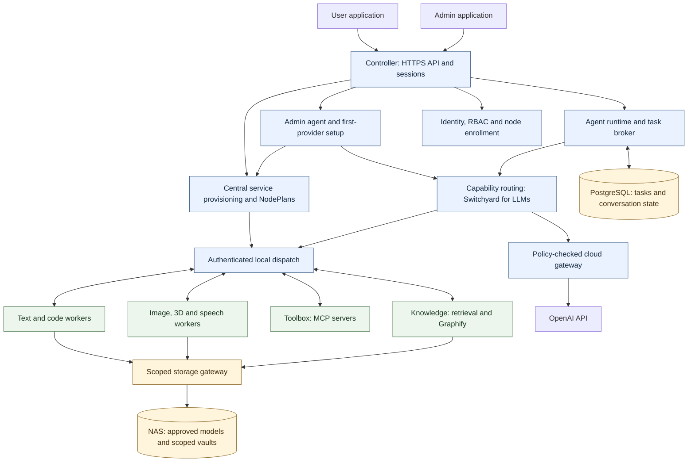

# Architecture and decisions

## Responsibilities

The unit offered to a user is a **capability**, such as `code.implement` or `image.generate`. A capability has typed inputs and outputs, minimum model features, an optional agent recipe, authorized tools, and fallback policy. A **deployment** is a specific model revision loaded by an engine on a node. A **role** such as toolbox or knowledge is an infrastructure service assignment. A **service recipe** describes approved packages, dependencies, settings and readiness checks. A revisioned **NodePlan** specifies what each member should bring up and serve. A **task** is durable work requested by a user or a parent task.

The same model deployment may satisfy several capabilities. Assigning writing and summarization to it must not load two copies. Several nodes may serve one capability for capacity or availability. A large model is never assumed to be split across these nodes.

## System diagram

Arrows to workers describe logical request flow. Workers initiate their authenticated control connections outbound to the controller. Raw inference engines bind to loopback and are reached through the worker agent. The broker can therefore survive DHCP changes without asking clients to track node addresses.

The dispatch box also carries tool and media jobs selected by their typed capability dispatcher. Switchyard selects LLM deployments; it does not independently authorize or execute every service request. Identity/enrollment includes the farm CA described in the security and pairing documents.

The admin agent uses a protected admin API namespace and the selected inference provider, with management changes routed through current administrator authorization and durable change sets. Ordinary user/task/tool traffic cannot enter that namespace. A deterministic first-provider wizard works before any LLM is available; a useful admin agent follows immediately after readiness validation, independently of MCP/knowledge services. [First-provider and admin-agent contract](12-ADMIN-AGENT-AND-FIRST-PROVIDER.md)

## Three coordinated layers

| Layer | Owns | Must not own |
|---|---|---|
| Control | Membership, identities, assignments, health, deployment reconciliation | Unrestricted access to private user content for administrators |
| Execution | Context assembly, model requests, tools, specialist dependencies, artifact creation | Permission creation or automatic cloud authorization |
| Knowledge | Conversations, topic records, provenance, scoped retrieval and indexes | Authority derived from text inside a retrieved document |

The controller hosts durable state and scheduling. An LLM can propose a plan or a specialist request, but deterministic code enforces limits, permissions, routing eligibility, and task transitions. Pure image or speech workers need not run an agent loop.

## Routing boundaries

Hearth filters candidates by caller permissions, capability schema, data locality, healthy lease, memory profile, context support, and budget before invoking Switchyard. Only eligible candidates reach it. The chosen result is validated again before dispatch. Classifier calls are inference calls too and obey the same locality and budget controls. A small local classifier is optional; deterministic capability routing is always available.

Upstream Switchyard supports embedding model selection in another harness. Its current standalone server is described as a demonstration component. Integrate a pinned library behind an adapter, rather than treating its example proxy as Hearth's security boundary. [Upstream reference](https://github.com/NVIDIA-NeMo/Switchyard)

Media uses a typed service dispatcher; do not assume an LLM router natively schedules every image or audio pipeline. It shares the same candidate registry, authorization, and usage accounting.

## Deployment decisions

| Decision | Rationale and consequence |
|---|---|
| First installer creates the Hearth Node | One owner-controlled control head; later installers join using address/port |
| Managed Linux control appliance; native heterogeneous workers | Portable first-node setup on supported Windows/Linux/macOS without manual VM or container administration |
| Central service recipes and NodePlans | Assignment installs/configures the correct runtime, model and dependencies; members need no local service configuration |
| Agent-assisted administration after first-provider setup | Conversational setup uses the same management domain APIs and permissions as dashboard forms; provider outages never remove manual administration |
| One logical controller in release 1 | Durable recovery without distributed consensus; controller loss pauses coordination |
| PostgreSQL on local SSD | Transactional tasks and authorization; never place the live database directory on SMB/NFS |
| Outbox plus leased jobs | Reliable transitions and at-least-once delivery with modest operational overhead |
| Gateway access to NAS | Workers receive only assigned content, never a shared NAS password |
| Markdown projections plus database transactions | Conversations remain browsable; concurrent agents do not race to edit transcript files |
| Per-user/workspace memory partitions | Private graph nodes never enter another user's ranking or prompt |
| Existing inference engines | Hearth owns lifecycle and policy, not numerical kernels |
| Separate admin and user origins | Distinct sessions, navigation, CSP, and authorization expectations |
| Optional, bounded OpenAI fallback | Missing local capability need not break the interface; no accidental data export |

This package's defaults are design decisions. They are not claims that the selected tools already provide the full system.

## Supported first-release host matrix

The target matrix and minimum-version qualification process are binding in [11-INSTALLATION-AND-CENTRAL-MANAGEMENT.md](11-INSTALLATION-AND-CENTRAL-MANAGEMENT.md): Windows x86-64, Linux x86-64, macOS Intel, and macOS Apple Silicon installers. Each can create the managed control appliance when its hypervisor/resource probes pass, or join as a native member. Supported installer OS does not imply every GPU/model/modality is supported there.

The native supervisor reserves resources for the control appliance and exposes only approved listeners. The head's native worker can also serve GPU jobs without GPU passthrough. Linux-only CPU service recipes may use a managed service appliance on another host when explicitly supported. Runtime/backend compatibility is always measured. [Engine reference](https://github.com/ggml-org/llama.cpp)

## Resource behavior

Default to one generation slot and one resident model per GPU. Reserve the greater of 2 GiB or 15% of reported dedicated VRAM for the OS/runtime before accounting for weights, KV cache, and workspaces. This is an initial policy, not a guarantee of fit. A measured deployment profile may tighten the budget while retaining headroom. Use bytes in APIs and GiB in displays. No automatic partial CPU offload under a profile labeled fully resident.

A capability assignment resolves an approved service recipe into a versioned NodePlan. The member installs its dependencies, renders typed private settings, stages model artifacts, starts the service, and probes it before registration. Assignment is desired state; deployment readiness is observed state. Warm deployments stay loaded across requests. Cold-start requests show their wait and must not evict pinned assignments. Extra compatible roles are queued or rejected with an explanation when capacity is exhausted. CPU roles and control services do not consume a GPU assignment slot.

## Nonfunctional targets

LAN discovery event visible within 10 seconds on a multicast-capable subnet. Returning healthy workers routable within 15 seconds after their engine becomes ready. Heartbeats every 5 seconds; no new work after a 15-second stale lease. User/admin state updates within 2 seconds under the reference load of 10 nodes and 20 signed-in users. These are acceptance targets for the software overhead, not promises about model generation speed.

Cancellation reaches a healthy worker within 2 seconds. Model and tool jobs have explicit deadlines. Request orchestration adds a target p95 under 150 ms before dispatch, excluding retrieval, classification inference, provider time, and cold loading. Record those separately rather than hiding them in a single latency figure.
