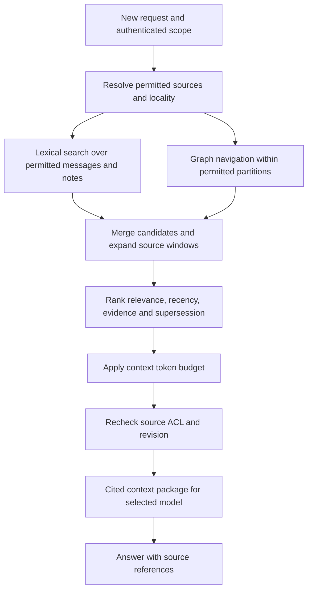
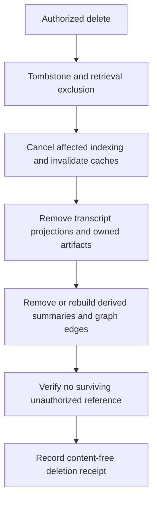

# Conversation history, Obsidian vaults, Graphify, and retrieval

## Storage model

The farm owns continuity across model replacements and worker changes. Store original user-visible messages, permitted tool results, references, and artifacts as durable records. Do not store hidden model reasoning as a requirement. Large tool outputs become artifacts with references, not unlimited transcript text.

PostgreSQL is the transaction authority for message order, identity, ACLs, and revision state. A transactional outbox projects committed records into readable Markdown/JSONL files. The vault is a durable, inspectable projection that can be rebuilt, exported, and used by Obsidian. User-authored notes in designated directories are imported as new revisions through the knowledge service.

This explicitly avoids competing writers to the same transcript. It also avoids relying on Obsidian itself as a multi-user database. Obsidian stores local Markdown notes; using it to inspect exported records does not provide Hearth's authorization or synchronization layer. [Obsidian storage](https://help.obsidian.md/Files+and+folders/How+Obsidian+stores+data)

```text
vault/
  conversations/2026/09/<conversation-id>.md
  conversations/2026/09/<conversation-id>.jsonl
  topics/<topic-id>.md
  decisions/<decision-id>.md
  preferences/<preference-id>.md
  authored/                    # owner-editable notes imported as revisions
  artifacts/<reference-id>.md
  graph/                      # exported derived view, never authority
  indexes/                    # projection manifests and revision markers
```

Use opaque IDs in paths. Markdown frontmatter includes schema version, scope, source IDs, revision, timestamps, locality, and generated/authored status. Do not place secrets in frontmatter. Generated files display their authoritative source and last projection revision. Manual edits to generated files are surfaced as conflicts and preserved for review rather than silently overwritten.

## Topic records

Every durable assertion stores subject/topic, statement, source message/artifact spans, author type (`user`, `assistant`, `tool`), evidence status (`asserted`, `inferred`, `verified`), valid-from time, supersedes relationship, scope, locality, and revision. A graph edge has its own provenance and scope. An assistant's claim is not promoted to verified merely because it was repeated or summarized.

Graph relationships can link a project, a conversation, a decision, an implementation artifact, and a later correction. Support both temporal search (“what did we decide in August?”) and current-state retrieval (“what is the latest decision?”). Preserve contradictory assertions with their sources until resolved. User corrections take precedence for their preferences; objective facts still retain provenance.

## Graphify adapter

Select the Graphify-Labs/graphify project as the intended upstream unless the user later identifies another. Pin its source revision and package identity. It exposes graph querying and Obsidian export features; semantic extraction may invoke a configured model, so it is not automatically an offline, authorization-aware memory service. [Graphify upstream](https://github.com/Graphify-Labs/graphify)

Run Graphify against an isolated export of one authorized partition, with explicit backend and model configuration. Strip ambient cloud credentials and deny external egress. Route semantic extraction through Hearth's internal inference adapter; provide a private OpenAI-compatible endpoint if the pinned version needs it. Do not rely on provider auto-detection. Use a separate temporary directory per partition/job; validate output before importing edges.

The adapter imports only source-backed IDs from the supplied partition. Reject output that references unrelated files, invents a scope, or changes source locality. Apply runtime limits, cancellation, and incremental hashing. A graph job cannot make its own cloud-policy decision. If Graphify's current API is incompatible, implement the adapter against its supported pinned CLI and preserve the same typed result contract; document the choice.

Graphify is optional for baseline retrieval availability. PostgreSQL full-text search and explicit topic links remain usable when the graph job fails. Add embeddings later only if a held-out retrieval evaluation demonstrates sufficient benefit. A compulsory Qdrant deployment is outside this release.

## Retrieval pipeline



Partition before traversal, ranking, or summarization. Do not compute over the full private graph and merely filter the final answer. Cache keys include principal/workspace authorization version, source revisions, locality policy, query, and retrieval algorithm version. A revoked workspace membership invalidates results immediately.

Recent messages form working context. Retrieve additional history as needed by topic, entities, time, and explicit user references. Initial allocation: up to 25% of the selected model's usable input budget for retrieved history, leaving room for instructions, recent conversation, tool schemas, and output. Truncate by relevance and source windows, not arbitrary byte cuts; expose when context was omitted. A summary links to original source messages for follow-up retrieval.

Citations use authenticated application URLs to a conversation message or artifact span. The application checks authorization again when opening them. The same source references work regardless of the answering model.

## Recording and background consolidation

Commit each accepted message before scheduling dependent work. Mark interrupted outputs explicitly. Projection jobs are idempotent by record revision and write temp files followed by atomic rename. Outbox lag is visible in admin and user memory views. If the NAS is down, retain committed messages in the local encrypted database and spool; no claim is made that vault synchronization is current.

Consolidate topics after a conversation quiet period, default 5 minutes, with a maximum 1-minute indexing job queue delay under reference load. Graph extraction can lag without blocking chat. Proposed durable memory is derived from permitted sources and categorized as a preference, decision, fact, question, or task. Store source links and confidence; require explicit confirmation for an inferred preference that would change user settings or permissions.

Memory retrieval does not execute instructions embedded in old transcripts or notes. Render retrieved passages as quoted data with provenance. Trust and tool authority come from current system policy and the active user request.

## Multi-user sharing

Each personal vault is a separate partition. Workspace knowledge is another partition with membership checks. Publishing a private conversation creates a deliberate shared revision; it never makes all of the author's history discoverable. Global knowledge is curated and explicitly published. Sharing preserves original source locality and can become more restrictive, never silently less restrictive.

A conversation associated with a workspace but still private to its author belongs to a private ACL partition, not that workspace's shared graph. More generally, each extraction partition contains only records with the same effective audience. Cross-partition retrieval is assembled after authorization; a model-generated summary may not merge audiences into a more permissive record.

To use Obsidian directly, export a scoped vault or use a service-mediated sync/export workflow. Do not hand every user a NAS account that can read all partitions. The reference release supports authenticated vault export and authored-note import; a fully bidirectional Obsidian plugin is deferred. This still provides actual persisted Markdown conversations and graph exports on the NAS.

## Correction, deletion, and retention

The user can edit their preference records, correct topic assertions, exclude a conversation from future retrieval, export their data, or delete conversations and their derived material. Exclusion is immediate through source eligibility. Deletion commits a tombstone and increments the source/ACL generation before returning success.



Derived records retain complete lineage. A summary with both deleted and surviving sources is invalidated and rebuilt solely from surviving sources; deleting one graph edge is insufficient if the text still includes the fact. Projection/index workers check tombstones at read and final commit to avoid recreating deleted content. Shared copies require an explicit product policy: default to live references, so source deletion withdraws the shared material. Independently authored notes are not silently rewritten; flag affected citations for review and retrieval exclusion until reconciled.

Default conversations remain until the user deletes them. Temporary task artifacts expire after 7 days unless saved; saved artifacts follow conversation/workspace retention. Indexes are disposable. Backups expire after 30 days by default; deletion cannot instantly erase offline backups, and restore must apply the external deletion ledger before serving. The UI states the difference between immediately unavailable content and physical cleanup completion.

## Knowledge service placement

The admin can assign the knowledge role to an enrolled Linux node. It runs extraction and retrieval under a service identity with partition-scoped jobs. The transactional message store stays in the controller database. If the knowledge worker is offline, chat continues with recent history; show that long-term recall is temporarily unavailable rather than hallucinating a memory. CPU-only knowledge work is allowed; semantic extraction can request another inference worker.
