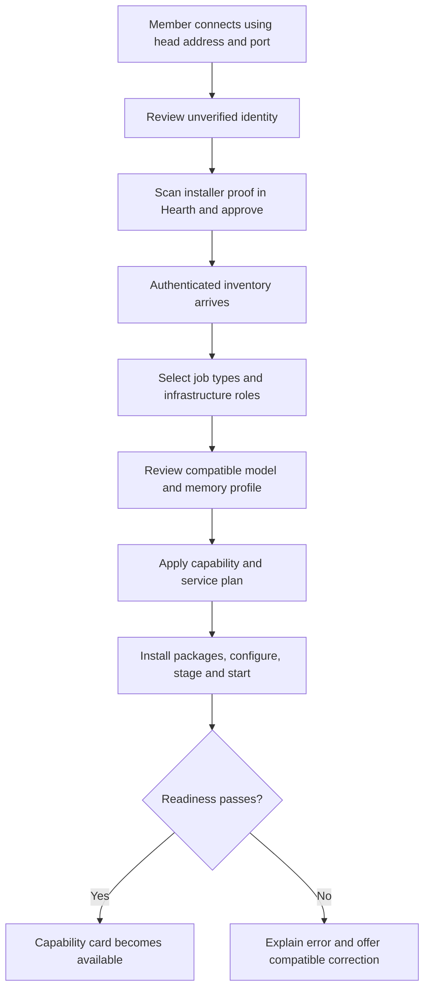

# User and administrator interfaces

## Interface principles

Ship two applications with independent BFF sessions. The default IP-based setup uses HTTPS ports 8443 for admin/head, 8444 for users and 8445 for identity, with the cookie/origin controls in [11](11-INSTALLATION-AND-CENTRAL-MANAGEMENT.md). Optional DNS mode uses separate origins and cookie names: `https://hearth.home.arpa` for users and `https://admin.hearth.home.arpa` for administrators. Use `https://auth.hearth.home.arpa` for identity. These are suggested local-DNS names configurable centrally. Do not assume they resolve automatically or that browsers already trust the farm CA; the setup guide configures DNS and trust explicitly.

Use clear typography, restrained colors, readable density, keyboard access, meaningful focus states, and layouts usable on a laptop or phone. Status uses text and icons in addition to color. All tables have empty, loading, error, and disconnected states. No simulated telemetry appears outside labeled Demo mode.

## Admin navigation

Overview, Admin agent, Capabilities, Nodes, Models and Packages, Storage, Toolbox, Knowledge, Users and Roles, Cloud and Budgets, Audit, Settings. Only authorized sections appear, and APIs independently enforce the same permissions.

### Overview and capability dashboard

```text
Hearth administration                         Live | Owner menu

Local ready 6    Unassigned 3    Offline 1    Cloud configured 4
New machine detected: LAPTOP-NEW              [Review and pair]

Search job types...     [All states] [All nodes] [All modalities]

Coding                   Writing                 Image generation
LOCAL READY              LOCAL READY             UNASSIGNED
Tower / Model A           Laptop / Model B        OpenAI configured
Queue 1 | measured speed  Queue 0                  No local worker
[Inspect] [Assign]        [Inspect] [Assign]       [Assign a machine]

Transcription            Speech                  Topic memory
OFFLINE                  LOADING                 READY
Laptop last seen 2m      12.4 / 18.0 GiB          Knowledge node
[Inspect] [Reassign]      [View progress]          [Index health]
```

Every job type remains visible. A capability card shows local state, assigned node(s), model revision, queue depth, observed latency/speed with units, and separate cloud configuration. States include Unassigned, No compatible recipe/model, Planning, Downloading, Installing, Configuring, Starting, Warming, Ready, Busy, Offline, Failed, Local action required, and Disabled by policy. Display an exact reason rather than a generic red dot. An admin cloud badge means configured; user eligibility depends on their policy.

Selecting a job type opens a drawer with requirements, local deployments, approved models ranked by measured suitability, quality evidence, fallback configuration, and Assign action. Assigning to an already-resident compatible model adds a mapping, not another load. New job types can be defined from approved capability templates with schemas and tests.

### New-node flow



Job types may be provisionally selected during pairing, but final fit is evaluated from authenticated inventory. Pairing identity verification is essential setup, not a repeated prompt for an already enrolled machine. Ignoring an observation does not revoke an existing identity. Revocation has a separate action and effect summary.

### Node detail

Show trusted identity/fingerprint, last heartbeat, version, measured GPU memory, driver/backend probes, current power policy, cache usage, deployment progress, and role assignments. Actions: drain, resume, change assignment, retry failed load, rotate enrollment, revoke, and request a redacted diagnostic bundle. A profile explicitly identifies full GPU residency versus CPU offload. All normal node settings are editable here: capabilities, runtime/model choices, approved expert-cache profile where available, resource/concurrency limits, storage quotas, power policy, maintenance and update settings. Show desired versus observed revision and Pending delivery for offline nodes. Provision packages automatically after Apply; never send the operator to edit a member config file.

### Storage and models

Storage wizard follows [NAS setup](03-NAS-AND-MODELS.md). Password fields never redisplay stored secrets. Catalog rows show approval, source revision, license status, quantization, formats, verified sizes/hashes, capability tags, compatible measured nodes, and evaluation results. Quarantined artifacts are visibly unavailable for assignment. Approval of executable runtime code is separate from approval of a weight file.

### Toolbox and knowledge

Toolbox view shows assigned host, server package versions, available tools, permissions, credential scope, approval class, recent errors, and test-connection status. Knowledge view shows projection lag, per-partition indexing status and counts, graph health, deletion jobs, and last successful backup. Operational admins see metadata; inspecting private records requires the actual content owner's authorization.

### Users, RBAC, and cloud

Users view supports account suspension, farm role grants, custom roles from a permission catalog, workspace membership administration within granted authority, quotas, and redacted audit history. Prevent accidental removal of the last Owner. Role elevation requires step-up authentication.

Cloud view configures OpenAI credentials, allowed model IDs per capability, price revisions, farm ceilings, user allocations, and allowed overflow reasons. Provide a test that reports whether a paid request will occur before running it. Show reserved, settled, and uncertain usage separately. Disabling a provider immediately prevents new calls; do not imply it cancels every upstream request already in flight.

## First provider and conversational administration

After Create Hearth, show the deterministic first-provider wizard from [12](12-ADMIN-AGENT-AND-FIRST-PROVIDER.md): run a compatible model here, join another machine, or use OpenAI. Local library setup can precede NAS. The cloud route needs no GPU or NAS, and requires secure key entry, configured budget/data allowance and a disclosed bounded real test. Distinguish connection, real inference and admin-tool readiness; failure leaves manual setup usable.

On success, offer Talk to the admin agent or Continue with the dashboard. Agent chat lives only in administration and may open beside the selected node/capability/settings screen. Show the active provider/locality badge, current resource scope, a concise activity trail, trusted secure-input/pairing cards, concrete change previews and linked operation progress. Approve one complete change set rather than every dependency step. Optional bounded routine-setup grants clearly show target nodes, allowed actions, resource limits and expiry with a revoke control.

Agent messages cannot render arbitrary privileged forms or fake success cards. Credentials and pairing proofs go directly to protected services, never through chat. The UI shows observed outcomes separately from suggestions and submitted changes. When the provider fails, the dashboard and provider wizard remain available, and accepted operations remain visible. Models lacking a validated action protocol are labeled chat-only. A01-A12 validate this experience.

## User application

Primary navigation: Conversations, Projects, Memory, Files, Preferences. Signup and login are available to eligible LAN clients. Users never need to pick a physical node.

A conversation supports streamed text, attachments, images, audio, citations to previous messages, and an expandable activity trail. The composer includes an optional job type override and locality choice. Defaults are Auto capability and Local only. The model can call specialists when useful, but activity remains associated with the same user turn.

```text
Conversation: Explain the combat system

You: Make an illustrated explanation with narration.

Activity
  Retrieved 4 project decisions
  Coding specialist inspected 3 source files
  Writing specialist prepared the explanation
  Image generation using OpenAI [cloud allowed for this request]
  Speech worker generating narration

Assistant: ... useful final explanation ... [source 1] [source 2]
[Illustration] [Play narration] [Download artifacts]

[Attach] Message...            Local only / Prefer local, allow cloud
```

Show unavailable capabilities honestly: “Image generation has no local worker. Cloud use is disabled for this conversation.” Offer Queue locally, Change allowed setting when permitted, or Continue without that output. Do not trap the user in an endless spinner. Locality choices apply within administrative/source policy, not above it.

## Memory experience

Memory has searchable conversations, topic notes, decisions, and preferences. Every derived item opens its original sources and shows current versus superseded status. Users can correct, exclude from recall, export, or delete their content. Graph browsing uses only authorized partitions. Deletion has an immediate retrieval-excluded state and a later cleanup-complete receipt.

Personal history is the default. Publishing to a project has a preview of recipients and included records. Do not expose a shared graph that reveals private topics through counts or connections.

## Acceptance of interface quality

Playwright covers the complete signup, pair, assign, chat, tool, memory, and cloud-blocked paths. Test keyboard-only use, narrow layout at 390 px, desktop at 1440 px, light/dark contrast, reconnects, long names, no models, and every unavailable state. Capture screenshots with fixture IDs and label them as fixtures. Validate real telemetry separately against worker events.

## First-run and service provisioning

The first installer opens Create Hearth; later installers need only its address and port. Owner/MFA, LAN access, NAS, catalog approval and cloud settings are configured once through the control head. New members wait for central proof approval. After approval, the Assign drawer resolves compatible service recipes and offers safe defaults. Selecting Image generation installs the image runtime/model; selecting 3D generation installs an approved geometry recipe; selecting text jobs installs the text engine. The UI distinguishes an unavailable recipe from missing models or insufficient hardware.

Apply shows package/model sizes, resource reservations, progress, and precise failures. Settings persist across restart and reconnect. Routine diagnostics, retries, upgrades, drains and role changes require no SSH/RDP or local editor. A host-level permission, firmware or physical intervention is shown explicitly as Local action required, with a precise reason. [Binding setup and provisioning contract](11-INSTALLATION-AND-CENTRAL-MANAGEMENT.md).
