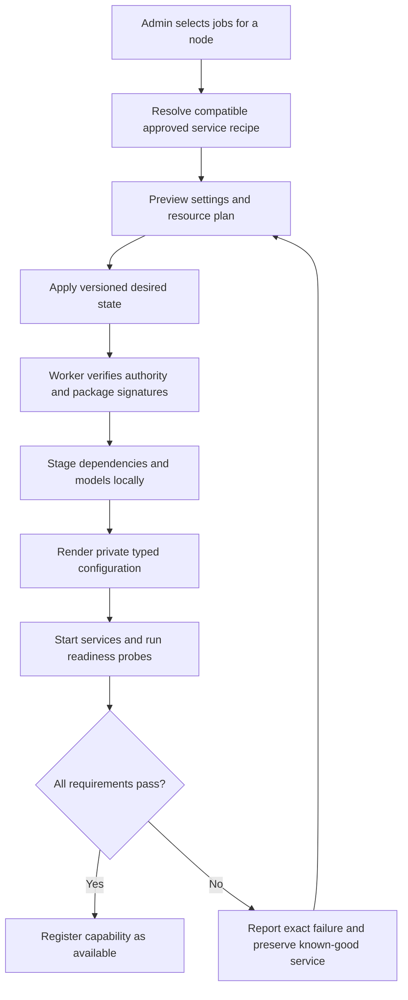

# Installation and central node management

**Binding specification, revision 1.2, 12 September 2026.** The first installation creates the Hearth Node, which is the farm's control head. Subsequent installations join it. A member's only required configuration input is the Hearth address and port. All capabilities, runtime packages, models, storage access, service settings, and updates are managed through the Hearth admin interface, including the optional conversational admin-agent surface in [12](12-ADMIN-AGENT-AND-FIRST-PROVIDER.md). The CLI examples below are build contracts, not existing downloadable installers.

## Product experience

1. Run the signed Hearth installer on the first Windows, Linux, or macOS machine. It checks prerequisites, installs the service, and opens a local first-run page. Complete **Create Hearth**, create the Owner, enroll MFA, and save recovery material. That machine becomes the Hearth Node. Installation order is not a distributed leader-election protocol.
2. Hearth shows its join address, such as `192.168.1.20:8443`, and trusted interface links. Complete the deterministic first-provider wizard: local model here, model on a joined member, or OpenAI. Use the relevant member steps below when that path is selected. NAS, MCP and knowledge can wait; a local library supports local bootstrap. After a real provider/tool readiness check, choose Talk to the admin agent or Continue with the dashboard for further setup. [Full wizard and authority contract](12-ADMIN-AGENT-AND-FIRST-PROVIDER.md)
3. On another machine, run the installer with that address and port. It installs the minimal native agent, starts automatically, and displays **Waiting for Hearth approval** plus a one-time pairing proof. No model, Python, Docker, NAS, provider, or role configuration is requested on that machine.
4. The new machine appears in Hearth. In the authenticated admin interface, scan/paste its installer-displayed pairing proof and approve enrollment. No file, CA bundle, or token needs to be entered back into the member.
5. Select what the machine should serve. Hearth computes compatible service packages, dependencies, models, and resource reservations. **Apply assignment** stages, configures, starts, probes, and registers the service automatically.
6. The member continues as an OS background service after the installer closes, the user logs out, or the machine restarts. Future configuration and routine troubleshooting take place in Hearth.

```text
# Proposed signed installer usage; artifacts do not exist yet.
# Windows: first node opens Create Hearth setup.
.\Install-Hearth.ps1

# Windows: joining member.
.\Install-Hearth.ps1 -Hearth "192.168.1.20:8443"

# Linux/macOS: first node opens Create Hearth setup.
sh ./install-hearth.sh

# Linux/macOS: joining member.
sh ./install-hearth.sh --hearth "192.168.1.20:8443"
```

An address supplied to an existing enrolled installation reconnects only if it authenticates as the same farm. Changing farm ownership requires an explicit reset/re-enrollment workflow, not a silent address edit. An unreachable address keeps a member waiting; it must never turn into a new control head.

The first-node page can also accept an existing Hearth address when the script was started without one. Creating a new farm requires completing the explicit create operation. Existing installation identity always takes precedence over discovery results. Two separately initialized farms retain separate identities and never merge automatically.

## Supported hosts and packaged control services

Ship one Hearth product with OS-specific signed installer wrappers and native Go service packages. A host can be the control head, a member, or the control head with execution assignments. Keep the role distinction inside the product, not separate manual installation guides.

The default control distribution is a managed Linux appliance containing the existing Compose services: PostgreSQL, Keycloak, Caddy, step-ca, API, orchestration, and storage gateway. Hearth downloads and verifies the appliance, starts it, forwards the configured listeners, persists its data, updates it, and handles recovery. Users do not install or operate Docker, Compose, a database, or a VM console.

Use pinned QEMU packages with KVM on Linux, WHPX on Windows, and HVF on macOS. Build same-architecture x86-64 and arm64 appliance images; do not silently substitute slow CPU emulation for a missing hypervisor. QEMU documents these accelerator families, but Hearth must validate its own packaging and host combinations. [QEMU host accelerators](https://www.qemu.org/docs/master/system/introduction.html), [WHPX](https://www.qemu.org/docs/master/system/whpx.html)

| Host target | Installer/service | Control-head path | Worker path |
|---|---|---|---|
| Windows x86-64 | PowerShell wrapper; Windows service | Managed x86-64 appliance with WHPX | Native supported runtimes, including GPU inference |
| Linux x86-64 | Shell wrapper; systemd | Managed x86-64 appliance with KVM | Native supported runtimes |
| macOS Intel | Shell/package wrapper; launchd | Managed x86-64 appliance with HVF | Native CPU baseline; GPU only if validated |
| macOS Apple Silicon | Shell/package wrapper; launchd | Managed arm64 appliance with HVF | Native CPU/Metal profiles only after validation |
| Other OS/architecture combinations | Declare separately | No inferred support | No inferred support |

Minimum OS versions and compatible hypervisors are resolved and locked in P0. A legacy Mac may qualify as a member but not as a control head. Show that distinction in the installer. All rows are required packaging targets; real release claims require the corresponding hardware gates. Native manual Linux Compose installation may remain an advanced operator path with the same API/contracts, but cannot be the default onboarding dependency.

Keep GPU execution on the host's native worker; GPU passthrough into the control appliance is not required. The Hearth Node's own worker enrolls through authenticated local bootstrap and appears in Nodes with the same assignments and quotas. Control services reserve CPU, RAM, and local SSD before inference admission. The existing 4 CPU / 8 GiB RAM / 40 GiB disk appliance allocation is a provisional envelope, not an assertion that an 8 GiB host can support it plus its OS and inference.

A host-side supervisor owns the managed appliance and a narrow privileged helper. Inference/media processes run unprivileged. QEMU management is accessible only over protected local IPC. Use a private NAT network with explicit port forwarding, no bridged public database or hypervisor control ports. Startup, listener reachability, DHCP, suspend, and reboot must be tested per OS.

## Bootstrap trust with no member configuration bundle

Address and port locate a machine; they do not authenticate it. One physical pairing proof is still required because LAN discovery cannot establish ownership. This is entered in Hearth's admin UI, never as additional member configuration.

1. The installer generates a persistent node key, random attempt ID and nonce, and a 256-bit random one-time pairing secret. It displays a QR/copyable proof containing those identifiers, the node public-key fingerprint, and the secret. Protect temporary storage with local OS permissions; do not write the proof into ordinary logs or command-line arguments.
2. The member sends only bounded public identity metadata to `/bootstrap/v1/pending` at the supplied address. It polls for an enrollment response. It has no model, task, secret, package-install, or inventory authority yet. Multicast is optional discovery assistance, not a requirement.
3. A stepped-up administrator scans/pastes the locally displayed proof into Hearth over an already authenticated admin session. Hearth matches the public identifiers, rejects mismatches, and authorizes the pending node. A short display label may help identify a card but cannot replace the full proof.
4. The controller returns an enrollment envelope encrypted and authenticated with that one-time secret using a maintained JWE implementation: fixed `alg=dir`, `enc=A256GCM`, fresh library-generated IV. Its contents include farm ID, farm CA, approved control origins, expected node key, attempt nonce, protocol version, a one-use CSR-bound token, and a 10-minute expiry. Use established JOSE libraries and interoperability/negative tests; do not implement encryption primitives. [JWE specification](https://www.rfc-editor.org/rfc/rfc7516)
5. The bootstrap transport cannot yet authenticate a private farm CA. Isolate it in a dedicated client accepting only public pending metadata and bounded ciphertext from the explicitly supplied endpoint. Never send the pairing secret, credentials, detailed inventory, or accept code/configuration through this client. The JWE proof authenticates the enrollment envelope. Reject redirects and unexpected endpoints. This transport must not be reused as a general insecure HTTPS client.
6. The worker validates the envelope and all bindings, installs the CA into Hearth's application trust store, then submits its CSR/token over fully verified HTTPS. The controller verifies proof of node-key possession and atomically consumes the token. Normal worker traffic uses mTLS and current membership checks. Delete the pairing secret after successful enrollment or expiry.

The enrollment attempt expires after 10 minutes; unattended waiting rotates fresh attempt/proof material and invalidates the old attempt. A proof is one-time authority and must be handled like a secret. Readiness, package provisioning, and full hardware inventory occur only after mTLS enrollment. Reconnecting an enrolled member never re-enters the anonymous bootstrap client automatically.

This is a proposed application protocol using standard components, not a claim that JWE alone supplies secure device enrollment. P0/P2 must prove key/nonce/endpoint bindings, tamper resistance, replay rejection, race handling, and complete separation from authenticated APIs. Certificate rotation, revocation, duplicate-identity quarantine, and 24-hour certificate lifetimes remain as specified in [02](02-DISCOVERY-AND-WORKERS.md).

## First-node browser setup and LAN access

The native installer opens a one-time loopback-only setup page with a high-entropy secret in the URL fragment. Bind to loopback, validate Host and Origin, prevent DNS rebinding/CSRF, load no third-party resources, and disable the page after owner bootstrap. It is a local installer surface, not a LAN administration endpoint. Headless first installation uses an authenticated SSH loopback tunnel to the same page; do not expose setup over unauthenticated LAN HTTP.

Offer working IP-based HTTPS origins before optional DNS configuration: head/admin and join on port 8443, user UI on 8444, identity on 8445. The first setup page shows and validates the selected LAN address/interface, port conflicts, certificate trust, and permitted CIDRs. Workers need only the head's 8443-equivalent address; the authenticated enrollment response supplies all service endpoints. Alternate ports remain configurable centrally.

The IP-origin profile uses separate BFF clients and distinct cookie names. Cookies are host scoped and are not isolated by port. Every BFF ignores other clients' cookies and enforces exact-origin CORS/CSRF, separate session stores and redirect allowlists. Do not mistake different ports for a cookie security boundary. DNS mode supports the separate user/admin/auth names already described in [07](07-INTERFACES.md), typically through port 443.

Local private CA trust is installed on the setup machine only through an explicit OS trust action. Other LAN browsers need the public root delivered through a trusted onboarding path, or an administrator-configured owned domain and publicly trusted certificate. Never tell users to click past certificate warnings. Worker enrollment installs application trust automatically; it does not add a general trusted root to every member's OS. The installer can prepare scoped listener/firewall rules for the chosen private interfaces with the normal OS installation consent; it never configures router/WAN forwarding.

## Capability assignment provisions services

The administrator assigns jobs, not startup commands. The controller resolves a dependency graph from signed, approved service recipes and compatible model artifacts.

| Assignment | What Hearth provisions |
|---|---|
| Chat, writing, coding | Compatible text engine, model files, context/resource settings, optional approved cache profile |
| Image generation | Approved image runtime, isolated dependency environment, selected Stable Diffusion or other image model/pipeline |
| 3D generation | Approved geometry backend, model and conversion/validation dependencies, output-format contract |
| Transcription or speech | Approved audio runtime and model/voice assets |
| MCP toolbox | Isolated tool host plus separately approved MCP server packages and scoped credentials |
| Knowledge | Knowledge worker, authorized vault/projection configuration, approved extraction/index backend |
| Storage gateway | Approved gateway package and restricted connector configuration; NAS authority remains scoped |

Runtime and model compatibility are separate checks. A Windows member may serve native text while an available isolated service appliance hosts CPU toolbox roles. A Linux-only recipe may install that managed appliance when explicitly supported; it must never silently claim host GPU passthrough or native compatibility. Show the extra resource cost before Apply. Every advertised recipe has a tested OS/backend profile, or is shown as unavailable on that node with an actionable reason.

Select an approved compatible default automatically. Show a concise assignment preview: service/model choices, download size, RAM/VRAM/disk reservation, local/cloud behavior, and a clear Apply action. Advanced settings are optional. Normal users never see Python environments, executable paths, engine flags, container YAML, or secrets. Model/package license approval occurs centrally and is reused for identical approved artifacts.

Each recipe specifies immutable package digests/signatures, capabilities, runtime entrypoint ID, typed settings schema, dependency DAG, minimum node protocol, platform/backend selectors, privilege/isolation policy, storage mounts, health/readiness probes, upgrade rules and rollback compatibility. Resolve shared dependencies once; multiple capabilities using the same deployment do not create duplicate models or environments.



## Central desired state and reconciliation

[Rendered provisioning flow](diagrams/11-INSTALLATION-AND-CENTRAL-MANAGEMENT-1.svg).

The node detail page owns assignments, model choice, typed runtime settings, cache limits, concurrency, queue/power policy, maintenance windows, restart/drain, runtime/agent updates, service secrets, diagnostics and revoke/uninstall actions. Resource settings are bounded by measured compatibility; an admin cannot turn a failed hardware probe into Ready with a checkbox.

Persist a revisioned `NodePlan` transaction containing farm/node IDs, controller generation, expected prior revision, service instances and dependencies, artifact identities, resource reservations, secret references, update policy and drain behavior. Return a conflict if two admins edit the same revision. The member journals each applied revision and reports observed state independently of requested state.

Reconcile in this order: validate plan and grants; check capacity; download/verify; create isolated service environment; render configuration; inject scoped secrets; drain conflicting old deployment; activate new service; run probes; publish readiness; commit observed revision; garbage-collect only unreferenced inactive artifacts. A failed update uses the compatible previous package/configuration when safe. Database or data-format migrations need an explicit tested rollback/restore plan, not an assumed binary downgrade.

Service states are `unassigned`, `planning`, `downloading`, `installing`, `configuring`, `starting`, `warming`, `ready`, `degraded`, `draining`, `stopped`, and `failed`. A healthy agent heartbeat never implies its requested services are ready. A new assignment that cannot fit may remain queued without evicting pinned existing work.

Agent upgrades use a verified restart-safe installer/helper and preserve identity, last-known plan, and rollback metadata. FarmAdmin can assign already approved packages; adding a new executable package requires the separate package-approval permission and Owner policy. Operator can restart/retry existing approved services. General task/tool channels cannot submit `NodePlan` changes. The protected admin-agent action executor can commit a reviewed or explicitly delegated change under live administrator permissions through the same management services as the dashboard; the model receives no administrative credential.

Secrets are entered in Hearth and delivered only to the authorized service identity over the enrolled channel. Never deliver the NAS library password to general inference workers. Packages are fetched from the head/gateway's approved immutable cache by default, not arbitrary download URLs supplied in prompts. Keep host package managers and ad hoc remote shell outside the command protocol.

Offline nodes retain their desired state locally and reconnect automatically. Edits made while they are offline display **Pending delivery** and are reconciled on return. A revoked node cannot receive pending configuration or packages. Local hand edits to managed service files are detected as drift, repaired or reported by policy, and do not become authoritative. Normal administration requires no RDP, SSH, local config editor, or container console.

## Limits that the interface must explain

One-time service installation/elevation, an OS trust action, a blocked firewall prompt, a driver update requiring reboot, firmware virtualization settings, and a powered-off machine cannot always be completed remotely. Report these as **Local action required** with exact recovery steps; do not ask the member operator to invent runtime settings. The helper cannot grant itself additional OS privileges beyond installation-time authorization. Avoid automatic GPU driver replacement in release 1.

The control head is a single coordinator in release 1. If it sleeps or fails, other nodes do not promote themselves. Existing bounded jobs follow the failure policy; new work and configuration wait. Central backup and a guided **Move Hearth** flow restore the same farm identity on a replacement installer, retire the old head, increment the controller generation, and reissue active credentials/grants. Controlled migration requires explicit fencing; disaster recovery requires confirming the old head cannot resume. Generation numbers alone cannot fence a disconnected old controller. Never run two restored copies concurrently.

## Phase ownership and release gates

| Phase | Binding additions |
|---|---|
| P0 | Installer/supervisor/appliance contracts, actual platform dependency probes, service recipe and NodePlan schemas, JWE interoperability proof, IP/DNS origin security design |
| P1 | First-node local bootstrap, owner/MFA setup, trusted admin/user links, separate BFF behavior including IP/port-origin tests |
| P2 | Minimal member install; address-only outbound pending registration; central proof approval; auto trust/cert provisioning; central node plan and observed state |
| P3 | Centrally approved runtime packages and model dependencies; signed recipes, staged local artifacts, scoped secret references |
| P4 | Assign text job through UI to a clean member; automatically install engine, load model, probe and route without local edits |
| P5 | Capability cards include provisioning states; compatible defaults and central reassignment across nodes |
| P6-P8 | Install toolbox/knowledge/image/audio and approved 3D recipe dependencies through the same lifecycle; validate each actual supported service |
| P9 | Clean OS install matrix, interrupted install/update recovery, browser trust flow, service logout/reboot behavior, offline edits, control-head loss/migration, central diagnostics |

Required scenario C01: on each supported control-head OS/architecture, start from an OS image without Docker/Python/PostgreSQL and reach authenticated Hearth administration using the installer and first-run UI. C02: on each supported member OS/architecture, supply only address/port, approve centrally, assign a capability, and complete a real request. C03: change that assignment/configuration, reboot, and demonstrate restoration without editing anything on the member. C04: where advertised compatible, switch from text to image or geometry and prove the correct distinct backend is installed and serves the job.

Security gates C05-C09 cover anonymous enrollment tampering/replay, wrong proof and rogue head, package tampering/arbitrary-command rejection, origin/cookie isolation, privilege boundaries, update rollback and duplicate-head fencing. Detailed evidence requirements are added to [09](09-VALIDATION-AND-RELEASE.md). This document specifies a friendly installation experience; no installer or application has been implemented by writing it.
