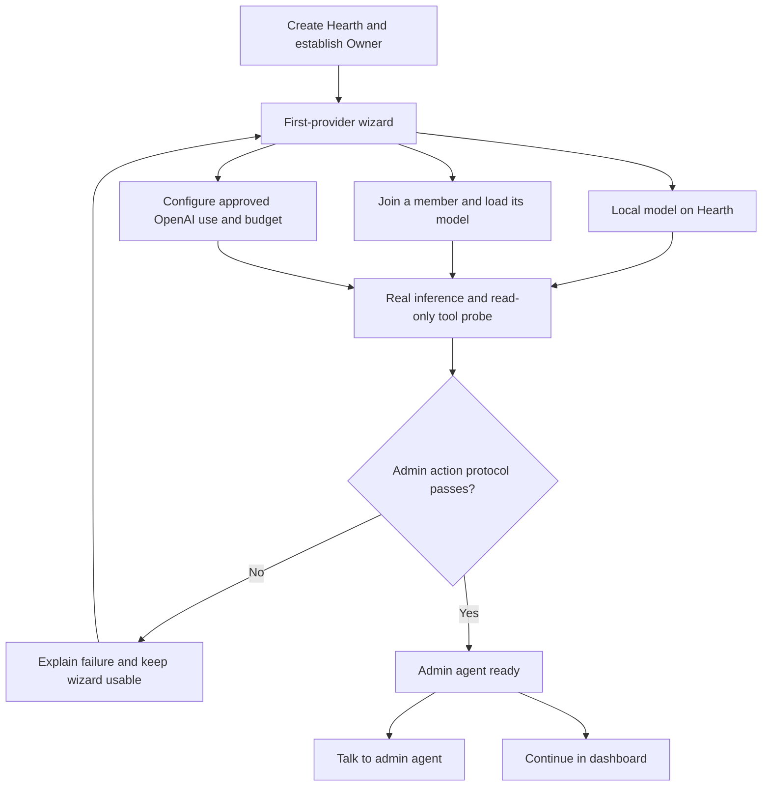
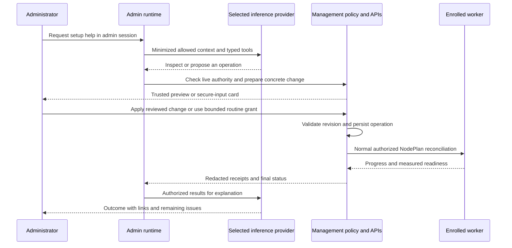

# First inference provider and the Hearth admin agent

**Binding specification, revision 1.2, 12 September 2026.** After a deterministic wizard validates the first inference provider, an authorized administrator can choose **Continue with the admin agent** to configure and expand the farm conversationally. The agent performs real, authorized management actions through Hearth's existing control APIs. Manual administration remains available throughout setup, provider outages and recovery.

## First-run wizard

The installer creates Hearth and establishes the Owner, MFA, browser trust and control-plane health using [11](11-INSTALLATION-AND-CENTRAL-MANAGEMENT.md). The next required step is **Connect your first inference provider**. This wizard is ordinary tested application code and cannot depend on an LLM, MCP toolbox, Graphify, NAS or another specialist already running.

Offer three equally functional paths:

| Choice | Wizard behavior | Evidence before completion |
|---|---|---|
| Run a model on this Hearth Node | Probe its native worker, offer compatible approved text models/profiles, show license/download/resource impact, then install and load the selection. CPU is allowed only as an explicitly tested profile. | Actual model response, identity, context/latency evidence and admin-tool protocol probe |
| Use another machine | Show the member installer and Hearth address/port. Keep the existing address-only join flow. Approve its installer proof in the secure central pairing component, select an approved model and apply its service plan. | Enrolled mTLS identity, verified service readiness and a real model/tool protocol probe |
| Use OpenAI | Collect the key in a secure form, select a validated model, configure allowed admin use, pricing and a positive bounded budget, explain the data sent, then run the disclosed bounded test. | Real response plus tool protocol, cost reservation/reconciliation and egress-policy checks |

Recommend a path from measured available hardware, but let the user choose. No silent cloud activation, fabricated key/model ID, hidden paid test, or assumed GPU compatibility. A connection test that would be billable shows the configured maximum cost before the user starts it; that approval covers the bounded probe and its permitted retry policy, not unlimited future calls.

NAS is not a first-provider prerequisite. For local bootstrap, offer a **Local model library** on the head's approved cache root through the same storage gateway/catalog interface. It accepts centrally approved downloads or an authorized imported artifact, with source/license, hashes, quarantine and scoped delivery identical to the NAS path. Workers still obtain artifacts through the head and receive no public repository credentials. A selected private source uses the secure credential form. Add NAS later through either the agent or ordinary administration; use immutable artifact identities to avoid needless duplicate downloads.

Distinguish `configured`, `inference_verified` and `admin_agent_ready`. An HTTP success or fabricated demo response does not establish readiness. Run a non-mutating round trip: the model requests the typed `farm.get_setup_status` tool, Hearth validates and executes it, and the model correctly reports the returned fixture-free state. Native function calls are preferred; a strict schema-constrained adapter may be used only if it passes the same contract. Never extract administrative commands from arbitrary prose with a permissive parser.

If a chosen provider can chat but fails the tool/schema probe, label it **Chat available; admin actions unavailable** and offer another compatible profile/model. The wizard remains usable and does not pretend action mode works. After validation, show **Talk to the admin agent** and **Continue with the dashboard**. The administrator can switch at any time; there is no second agent account to configure.

## What the agent can do

[Rendered first-provider flow](diagrams/12-ADMIN-AGENT-AND-FIRST-PROVIDER-1.svg).

An **Admin agent** entry is always visible to permitted administrators. It appears disabled with a precise provider/setup reason until ready. The conversation can also open beside Nodes, Capabilities, Storage, Models and Packages, Cloud, or Settings, carrying the selected resource as explicit context.

Examples of supported requests:

- Explain which machines can host image generation and show the resource tradeoffs.
- Help join a new laptop, then assign it writing work once its identity is verified.
- Connect a NAS model library and find approved models appropriate for the available workers.
- Prepare this node for Stable Diffusion, or an approved 3D service, and report when readiness passes.
- Change an approved context limit, diagnose a failed load, retry a corrected service plan, or drain a node before maintenance.
- Add an allowed OpenAI backup, explain the budget and privacy effects, and guide the administrator through the secure configuration form.
- Identify unassigned job types, propose capacity placements, and apply an approved set of assignments as one tracked operation.

It must inspect actual state before claiming facts or completion. A plan, accepted API request, staged artifact and ready service are different states. Responses cite node/service identifiers and observation timestamps, and link to the relevant admin screen. If a package, GPU backend or modality has not been implemented or validated, report the limitation accurately.

The agent can help a person install a new member by presenting the correct signed installer and address. It cannot remotely install Hearth on an unknown machine, defeat OS permission prompts, verify a pairing proof it has not received through the trusted UI, or configure a powered-off host. Those situations open a concise trusted action card; no invented progress.

## Runtime and management tools

Host the admin orchestrator as a control-plane module with its own API namespace, conversations and permissions. Its inference can use the selected local head/member deployment or OpenAI through the existing provider gateway. The model is not privileged software and does not receive a general administrative API token. A shared inference deployment does not share conversation/KV state or grants between admin and ordinary-user tasks.

Admin tooling is a fixed typed facade over the same domain services used by dashboard forms. It is available as soon as the first provider is ready; it does not require P6 MCP or P7 knowledge installation. The public user/toolbox registry must never expose these tools by name, alias or generic HTTP access.

| Tool family | Allowed behavior |
|---|---|
| `farm.get_setup_status`, `nodes.list`, `capabilities.inspect`, `catalog.list_approved` | Bounded operational reads with server-side field filtering and fresh revisions |
| `diagnostics.run` | Approved bounded checks, such as runtime compatibility or connector reachability; no arbitrary shell, script or URL |
| `changes.prepare` | Resolve typed intent to an immutable server-validated change set with exact targets, package/model digests, typed settings, resource impact and preconditions |
| `changes.apply`, `changes.status`, `changes.cancel` | Apply only with a server-held valid execution grant; monitor/cancel a durable operation without claiming universal rollback |
| `ui.request_secure_input` | Open a trusted credential/configuration form; return a scoped receipt/reference and validation status, never the secret |
| `ui.request_pairing` | Open the existing secure proof verification screen; return enrollment status, never proof material |

Tool arguments exclude principal identity, permissions, approval tokens and provider secrets. The server obtains them from the authenticated admin session and bound run. Each tool invocation rechecks live permissions, current resource revision, locality and remaining budget. No direct database editor, OS shell, arbitrary package installer, raw NAS mount command or general network client is exposed to the model.

Run ordinary and administrative workflows in distinct modes. Only authenticated `/api/v1/admin/...` requests can create an admin run. An ordinary conversation, specialist subtask, tool result or imported transcript cannot upgrade into this mode. The admin action executor commits NodePlans under the administrator's delegated authority; the general inference/task channel still cannot mutate them.

## Authority and approval behavior

Add `admin_agent.use` and `admin_agent.read_history_own` to the permission catalog. These grant access to the interface, not additional management power. Owner and FarmAdmin may use their existing permitted actions; Operator remains limited to inspection and already-authorized operational actions. Auditor may receive read-only agent access. Members have no access. Custom roles use the same anti-escalation checks.

Effective authority is the intersection of the live administrator permissions, the selected resource scope, the current run's execution grant, tool policy and farm policy. Do not use a permanently privileged shared agent identity.

Default behavior is **Inspect and propose**: read and diagnose without repeated confirmation, then show one concrete change card for a complete operation. The card includes target nodes, exact intended changes, download/resource impact, expected disruption, local/cloud effect, and any non-reversible step. **Apply** authorizes the whole versioned change set, including already approved dependency downloads and readiness probes. It does not ask again for every routine step. A user's reply to apply an already-presented unique change set can satisfy this confirmation; an ambiguous reply cannot authorize several different pending plans.

Offer an optional **Allow routine setup on these nodes for this session** grant. It explicitly names nodes, allowed action classes, resource/download ceilings and an expiry, initially 30 minutes. Within that scope, direct setup requests can execute without a new Apply click. Exploration/questions alone do not request changes. The original authenticated request is recorded separately from tool/model text, which cannot expand scope. The administrator can revoke the grant immediately.

Keep explicit stepped-up approval for granting roles, approving a new executable signer/package, accepting enrollment proof, widening egress/cloud policy or budgets, changing trust/recovery material, deleting retained data, uninstalling a node, or migrating/stopping the control head. The chat opens the same trusted UI forms as manual administration. A routine grant cannot authorize these operations. One approval covers a reviewed composite operation when its effects and required permissions are all specified.

Approvals bind the administrator, run, immutable change hash, target IDs, expected revisions, expiry and allowed effects. Default approval expiry is 10 minutes to start the operation. Apply rechecks every precondition; drift or a material plan change produces a new preview rather than reusing stale consent. On acceptance, issue a server-held operation grant bounded to that plan and its deadline. Logout expires conversational/routine grants and prevents new Apply actions; already accepted operations may finish only their recorded scope while live role/resource permissions remain valid. Cancellation or permission revocation prevents further privileged steps. Already-applied irreversible effects remain recorded and are not falsely described as cancelled.

## Secrets, private data and cloud use

[Rendered administration sequence](diagrams/12-ADMIN-AGENT-AND-FIRST-PROVIDER-2.svg).

API keys, NAS passwords, pairing secrets, recovery codes and other credentials go into trusted UI components that submit directly to the secret/enrollment service. They never enter model messages, tool results or model-visible history. Credential references are scope-checked and cannot be replayed for another node/service. If a user accidentally pastes a likely secret into chat, intercept it before model dispatch, prompt secure re-entry, redact stored conversational content and offer appropriate replacement guidance. Pattern detection is a secondary defense, not a guarantee that arbitrary secrets can be recognized.

Admin conversations are separate from ordinary conversation/topic memory. Persist each operator's admin history and operation references in PostgreSQL from the first release, scoped to its author and farm. Other admins see authorized operational audit records, not automatically private admin conversation text. Optional later sharing must be explicit. The agent has no general read access to Members' prompts, documents, artifacts or personal knowledge merely because an administrator can manage their worker.

Choosing OpenAI during bootstrap is an explicit choice for the admin-agent provider and its permitted data. It is not permission to export all farm information or to enable cloud use for Members. The wizard offers a standing allowance for the administrator's newly authored admin messages and a documented minimized operational field set, subject to policy. Existing histories and local-only sources retain their labels.

Default cloud-visible operational fields are opaque resource aliases, OS/backend class, measured capacities, capability/status names, approved catalog metadata and sanitized error codes. Omit secrets, raw configuration/environment files, usernames, private filesystem paths, LAN addresses, machine names and user content. Map aliases back to real resource IDs only inside the runtime. Detailed diagnostics require a separate explicit data-policy decision; redaction does not automatically make a local-only source exportable.

All model prompts and returned tool data pass the existing cloud gate, budgets and uncertain-call accounting. Even a read-only inventory result is an outbound disclosure when sent to OpenAI. Show a persistent provider/locality badge and usage record. A request to install a local model through a cloud-hosted admin conversation must obey the same restrictions. No provider gets direct LAN/MCP access.

Treat node labels, package descriptions, logs, imported model cards and retrieved documents as untrusted data. They cannot issue administrative instructions or fabricate confirmations. Test malicious diagnostics that request credential export, extra package installs or permission changes. A model-proposed operation must remain within the original request, reviewed change set or explicit bounded grant.

## Reliability and provider lifecycle

Use a bounded admin reasoning loop: initially 12 model/tool iterations and 5 minutes of active reasoning per turn, within the existing token/cost ceilings. Long package/model transfers become durable operations, initially with a centrally configurable 2-hour deployment deadline. They are monitored by ordinary controller code rather than continuous token-generating polling. Waiting for a human or durable job releases the inference slot. Expired unconsumed approvals or routine grants must be renewed before accepting additional operations; a previously accepted operation uses its own narrowly bounded grant.

Record run states `waiting_provider`, `running`, `awaiting_secure_input`, `awaiting_approval`, `waiting_operation`, `completed`, `failed` and `cancelled`. Operations retain separate progress and idempotency/fencing semantics. Retrying a streamed model response cannot repeat an applied change. Duplicate Apply requests resolve to the same operation; partially completed composite plans report exactly what succeeded and what remains.

Before changing or draining the agent's only inference provider, compute the impact. Prefer verifying a replacement route first when policy and resources permit. If the administrator intentionally removes the last provider, preview that consequence, persist the approved deterministic operation, complete it without depending on another model turn, and leave the manual dashboard and provider wizard available. Do not silently turn on OpenAI to keep the agent alive.

Provider failure keeps accepted operations visible and manageable in the dashboard. It never removes admin access, creates a new controller or grants broader cloud permission. Reconnect verifies provider readiness before resuming chat. Long-running actions do not rely on an open browser tab, but session/grant revocation still governs subsequent privileged steps. Controller restart recovers the run/operation ledger without repeating external effects.

## API and data additions

Persist `ProviderBootstrap` (selected path, stage, endpoint/deployment reference, probe evidence, readiness and cloud consent reference), `AdminConversation`, `AdminRun`, `AdminChangeSet`, `AdminExecutionGrant` and `AdminOperation`. Store keys/proofs only in their dedicated protected services. Grant records bind scope, allowed actions, ceilings, expiry and revocation; they are never returned to the model.

Expose versioned admin endpoints for `/provider-bootstrap`, `/provider-bootstrap/{id}/test`, `/assistant/conversations`, `/assistant/runs`, `/assistant/runs/{id}/events`, `/assistant/changes/{id}`, `/assistant/changes/{id}/apply`, `/assistant/operations/{id}`, and explicit grant revoke/cancel actions under `/api/v1/admin`. Complete exact schemas in P0. All data/event endpoints enforce principal ownership and live admin permissions. Secure-input and pairing components use existing protected endpoints; model-generated HTML is never rendered as a trusted form.

The first-provider test route reserves budget before any paid inference. Creating a test record does not itself authorize a call. Applying a change uses an idempotency key and expected revision; plan hash and grant validation commit transactionally with the durable operation/outbox. Actual completion comes from domain-service/worker receipts, not model prose.

## Phase ownership and acceptance

| Phase | Binding work |
|---|---|
| P0 | Define first-provider/agent contracts, tool schemas, read/write policy, secure forms, provider probes, operation/grant models and prompt-injection fixtures |
| P1 | Build wizard/admin-agent shells and protected admin namespaces; keep honest no-provider states; establish RBAC, secure inputs and history isolation |
| P2-P3 | Supply address-only member onboarding, central pairing, catalog/package provisioning and optional local model library needed by the wizard |
| P4 | Implement all three provider choices, minimum complete cloud safeguards, real tool round-trip readiness and a useful admin agent able to inspect and apply existing setup operations |
| P5 | Extend multi-provider selection, fallback, budgets and complex capability placement; keep local-only policy throughout admin tool loops |
| P6-P8 | Register newly implemented toolbox, knowledge and media/3D management actions through the same policy facade; agent usefulness must not wait for these phases |
| P9 | Run A01-A12 across first-provider choices, role boundaries, provider failures, real setup actions and the advertised host matrix |

The cloud path must be usable on a head with no local GPU and no NAS. The local path must be usable without an OpenAI key or paid account. P4 may proceed with one chosen path verified while another is genuinely externally blocked, but all required unverified release gates remain explicit. This changes build ordering: bring the safe minimal OpenAI gateway and budgets forward from P5, rather than creating a bootstrap shortcut that bypasses them.

See A01-A12 in [validation](09-VALIDATION-AND-RELEASE.md). No inference provider, paid call, admin agent, application or management action has been run by writing this specification.
