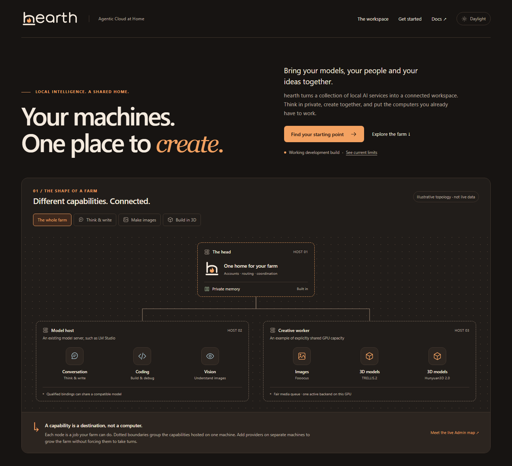

# hearth

Agentic Cloud at Home.

hearth will always be open source and free.

**Your machines. One place to create.** hearth brings local models into a shared workspace for private chat, channels, images, 3D models, memory and connected tools.

Built on the belief that inference belongs in our homes and on our devices, where conversations can stay between us and our families. Exploring this wave of technology should be within reach, without paying hundreds of dollars a month just to participate. That vision includes paying model makers for local-use licenses, with control over our own hardware and ongoing operation.

**[Explore the illustrated HTML README](docs/readme.html)** · Open `docs/readme.html` in your browser from a checkout. No build or server needed. GitHub displays the HTML source; the image above previews the page.

[Documentation](docs/README.md) · [What works and what is missing](docs/implementation/DESIGN_COVERAGE.md) · [Try it locally](docs/TESTING.md) · [Development](docs/DEVELOPMENT.md)

This is a working development build, not a qualified production release. The original specification is preserved in [docs/plan](docs/plan/README.md). Current behavior and qualification limits are in the [implementation ledger](docs/implementation/BUILD_STATUS.md).
