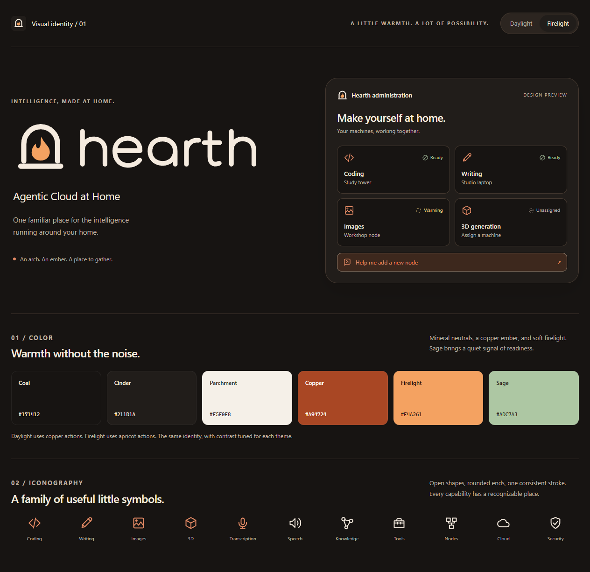

# Hearth visual identity

Identity v1.0, 12 September 2026. Product name: **Hearth**. Tagline: **Agentic Cloud at Home**.

Use this identity for the installer, first-provider wizard, user application, administration, and node tray surfaces. It supplements the engineering specification at revision 1.2. The original vector artwork and tokens in this folder are the implementation source. The gallery is a design reference, not a working application.

[Open the interactive identity gallery](index.html). Its Daylight and Firelight controls preview both appearances without a server or network connection.



## The idea

An arched surround shelters a single ember above a hearthstone. It suggests a warm central place where the home's machines gather. The custom lowercase wordmark repeats the arch's rounded geometry. Keep the mark compact, calm, and recognizable; use plain language around it.

The symbol does not change when a request uses the cloud or a different model. Execution location belongs in an explicit interface label. Hearth remains the common identity across writing, coding, speech, images, 3D, tools, and memory.

## Logo system

| Asset | Use |
|---|---|
| [Dark-surface lockup](logos/hearth-lockup-dark.svg) | Warm ivory lettering and apricot flame on dark surfaces |
| [Light-surface lockup](logos/hearth-lockup-light.svg) | Dark lettering and copper flame on light surfaces |
| [Single-color lockup](logos/hearth-lockup-mono.svg) | Inline SVG using the surrounding text color |
| [Dark-surface mark](logos/hearth-mark-dark.svg) / [light-surface mark](logos/hearth-mark-light.svg) | Navigation, splash screens, compact brand placements |
| [Single-color mark](logos/hearth-mark-mono.svg) | Tray templates, engraving, and single-ink reproduction |
| [Wordmark](logos/hearth-wordmark-dark.svg) | Standalone lettering when the symbol already appears nearby; light and mono siblings supplied |
| [Rounded app tile](logos/hearth-app.svg) | Web avatars, shortcut previews, standalone app illustrations |
| [Square app source](logos/hearth-app-square.svg) | Source for platform packaging that applies its own mask |
| [Simplified favicon](logos/hearth-favicon.svg) | 16-32 px browser or shortcut use |
| [Windows icon](logos/hearth.ico) | Multi-resolution ICO with 16, 24, 32, 48, 64, 128, and 256 px entries |

All wordmark letters are custom SVG paths, with no font dependency. The SVG uses scalable strokes, which remain editable. If a printer requires expanded outlines, convert strokes to paths in the export copy while preserving these masters.

PNG app exports are supplied at 16, 24, 32, 48, 64, 128, 256, 512, and 1024 px. The 16-32 px exports use the simplified mark. Transparent mark PNGs are supplied at 512 px for each appearance. Square app sources are supplied at 512 and 1024 px. The ICO embeds PNG frames; platform installation and signing remain build-phase work. macOS packaging should derive its iconset from the square sources and validate the platform-specific padding and mask.

### Sizing and placement

- Preserve the logo's aspect ratio. Give the mark at least 16 units of clear space on its 128-unit design grid; give a lockup clear space equal to one eighth of its height.
- Use the full mark at 32 px or larger, the lockup at 144 px wide or larger, and the simplified favicon below 32 px. At small navigation sizes, omit the tagline.
- Set the tagline as live text outside the lockup. Use the exact capitalization above. Do not bake small tagline text into app icons.
- Use the matching light/dark asset. The mono SVG uses `currentColor` only when inlined or embedded into a context that sets its own color. An SVG loaded with an HTML `img` element does not inherit the page's text color.
- Keep the arch and flame intact. Do not stretch, add a face, insert circuit traces, or use a continuously flickering flame. Any warm glow belongs to occasional large illustrations, not the core logo or dense controls.

## Palette

The six core colors establish the identity. Semantic tokens choose readable shades for the actual surface and purpose.

| Name | Hex | Role |
|---|---|---|
| Coal | `#171412` | Dark page background |
| Cinder | `#211D1A` | Dark cards and app tile |
| Parchment | `#F5F0E8` | Light page background |
| Copper | `#A94724` | Light-theme primary action and flame |
| Firelight | `#F4A261` | Dark-theme primary action and flame |
| Sage | `#ADC7A3` | Dark-theme readiness and positive status |

Use roughly 85% neutral surfaces and text, 10% supporting surfaces, and 5% accent as a visual starting point. This is not a metric enforced in code. Keep media outputs in their own colors. A gallery full of generated artwork should not be recolored to the brand palette.

### Theme tokens

[CSS source](tokens/hearth.css) and [JSON source](tokens/hearth-tokens.json) contain the complete matching token values. Use semantic names in components, not copied hex literals.

| Token | Daylight | Firelight |
|---|---|---|
| background | `#F5F0E8` | `#171412` |
| surface | `#FFFCF7` | `#211D1A` |
| raised | `#EDE4D8` | `#2C2520` |
| text | `#29211B` | `#F5EBDF` |
| muted | `#746354` | `#BFB0A1` |
| border, decorative | `#D9CBB9` | `#44382F` |
| control-border | `#927B65` | `#8C7867` |
| primary | `#A94724` | `#F4A261` |
| primary-hover | `#903C1E` | `#FFB77C` |
| on-primary | `#FFFCF7` | `#24160F` |
| accent | `#A94724` | `#E68B65` |
| accent-soft | `#F8E4D6` | `#3D281D` |
| success | `#406044` | `#ADC7A3` |
| success-soft | `#E5EDDF` | `#253226` |
| warning | `#765418` | `#E8C778` |
| warning-soft | `#F7EBCE` | `#3A301D` |
| danger | `#A0372C` | `#F0A194` |
| danger-soft | `#F9E4DE` | `#422823` |
| info | `#375F73` | `#A7C5D3` |
| info-soft | `#E1EDF1` | `#24323A` |
| focus | `#9A482B` | `#FFD2AC` |

For light-theme success, use the darker semantic green, not the pale Sage swatch as text. Similarly, the dark theme's apricot primary color belongs with dark `on-primary` text on buttons.

On first launch, follow the OS appearance. Offer **System / Light / Dark** in product settings; Daylight and Firelight are the gallery's descriptive names. Persist each user's choice and respect it across both authorized applications. A logged-out browser can remember its own appearance. Do not delay rendering until the preference request completes or flash a bright page while restoring dark mode.

The CSS implements OS fallback and explicit `data-theme="light"` or `data-theme="dark"` overrides. Preference persistence belongs to the real applications.

```css
@import "./hearth.css";

.hearth-panel {
  background: var(--hearth-surface);
  color: var(--hearth-text);
  border: 1px solid var(--hearth-border);
  border-radius: var(--hearth-radius-card);
}

.hearth-primary-action {
  min-height: 44px;
  background: var(--hearth-primary);
  color: var(--hearth-on-primary);
  border: 0;
  border-radius: var(--hearth-radius-control);
}

.hearth-primary-action:hover {
  background: var(--hearth-primary-hover);
}

.hearth-primary-action:focus-visible {
  outline: 3px solid var(--hearth-focus);
  outline-offset: 3px;
}
```

### Readability and status

The supplied color pairs pass **68 numerical contrast checks**: ordinary text at least 4.5:1; control boundaries and focus colors at least 3:1 against the three base surfaces. Calculations use unrounded sRGB relative luminance. These targets follow [W3C text contrast guidance](https://www.w3.org/WAI/WCAG22/Understanding/contrast-minimum.html) and [non-text contrast guidance](https://www.w3.org/WAI/WCAG22/Understanding/non-text-contrast.html). See the [machine-readable report](tokens/contrast-report.json).

The decorative `border` is intentionally subtle. It must not be the only visible boundary of an input, focus target, selected item, or status. Use `control-border` when a boundary is necessary to understand or operate the control. Use opaque text tokens; reducing opacity can invalidate the checks.

Always pair status color with text and a distinct glyph. Example mapping:

| State | Color token | Icon | Label/action |
|---|---|---|---|
| Ready | success | ready | Ready |
| Busy or warming | warning | warming | Exact state and measured progress when known |
| Unassigned | muted | unassigned | Unassigned; Assign a machine |
| Offline | muted | offline | Offline; last seen time |
| Failed | danger | failed | Failed; show cause and recovery action |
| Cloud execution | info | cloud | Cloud; identify provider and explain authorization separately |
| Disabled by policy | muted | lock | Disabled by policy; explain the applicable restriction |

The logo's orange does not mean a warning. For runtime state, the adjacent status text and semantic token are authoritative. Keep a configured cloud backend distinct from a request actually running in the cloud.

These palette checks are not a whole-application accessibility certification. Validate keyboard operation, semantic markup, focus placement, zoom, target size, actual component combinations, and screen-reader behavior during P1/P9. The dashboard in the gallery is a miniature composition with sample states; copy the styling, not its small specimen text sizes or invented machine names.

## Iconography

The kit includes **33 original line icons**, each on a 24 by 24 unit grid with a 1.75-unit stroke, rounded caps, and rounded joins. Read the [catalog](icons/catalog.json) for filenames, labels, and sprite identifiers. Individual SVGs and an [SVG symbol sprite](icons/hearth-icons.svg) are supplied.

| Group | Icons |
|---|---|
| Capabilities | chat, writing, code, reasoning, image, cube, vision, microphone, speech, embeddings |
| Infrastructure | hearth, node, nodes, cloud, tools, knowledge, storage, models, routing |
| Administration | security, users, admin-agent, activity, settings, add-node |
| States and appearance | ready, warming, unassigned, offline, failed, lock, sun, moon |

Use 20 or 24 px in normal UI controls, 16 px only for compact labeled status, and 32 px on capability cards. Reserve the distinctive hearth flame for brand and control-head placements. A model icon identifies its capability, not the current hardware vendor. Use the same job icon across unassigned, loading, ready, offline, and cloud states.

Put icon-only actions inside labeled buttons with at least a 44 by 44 px interactive area. Decorative SVGs next to text should have `aria-hidden="true"` and `focusable="false"`. An informative standalone SVG needs an accessible name. Never rely on an icon's shape alone to explain a destructive operation.

Bundle or inline the trusted SVG source through the React build. The external sprite works when served from the application's origin; `file:` browser restrictions can interfere with external `use` references. The offline gallery therefore embeds the same paths through a local script. Do not use its script as a dependency of the production application.

```html
<button type="button" aria-label="Add a node">
  <svg width="24" height="24" aria-hidden="true" focusable="false">
    <use href="/assets/hearth-icons.svg#hearth-add-node"></use>
  </svg>
</button>
```

## Typography, spacing, and motion

Use the native system sans-serif stack specified in the tokens: `system-ui`, `-apple-system`, `BlinkMacSystemFont`, `Segoe UI`, `sans-serif`. The custom logo is independent of this stack. Model names, hashes, command snippets, and technical values may use the supplied system monospace stack. No remotely loaded fonts are required.

- Body and inputs: 16 px, line height about 1.5. Compact labels: 14 px. Keep essential text at least 14 px; reserve 12 px for secondary metadata. Product headings: 24-32 px; larger text belongs in welcome screens.
- Font weights: 400 for body, 500-600 for controls and headings. Use tabular numerals for changing measurements. Avoid thin weights and widely spaced body text.
- Layout grid: 4 px. Common gaps: 8, 12, 16, 24, and 32 px. Controls: 10 px radius; cards: 16 px; dialogs: 24 px. Use capsules for concise labels, not every component.
- Keep dense admin tables quieter than the welcome screen. User chat emphasizes reading and media; administration emphasizes capability state and next actions. Share tokens and components while preserving the separate app/session boundaries.
- Transitions: 140-200 ms for short state changes. Disable nonessential motion under reduced-motion preference. Avoid ambient flames, looping sparkles, pulsing red backgrounds, and animated capability cards.

## Implementation handoff

1. Copy logo and icon masters to shared product assets, preserving filenames or supplying a checked mapping. Integrate CSS/JSON tokens into the shared design package during P1.
2. Build accessible React primitives using these semantics. Import trusted SVG paths at build time. Keep actual models, node labels, states, and measurements backed by the real APIs.
3. Apply the identity to first-run installation, provider onboarding, user chat, administration, and tray/shortcut assets. An unavailable admin agent must not prevent manual navigation or theme settings.
4. Add system/light/dark preference handling with first-render restoration. Validate no accidental white surfaces inside dark dialogs, menus, code blocks, or loading skeletons.
5. Exercise normal, hover, focus, disabled, selected, error, and offline states in both themes. Verify the actual UI at 320 px width and 200% zoom, including long labels and reduced motion.
6. Use platform-native packaging tools to produce and validate the final signed installer/app icon resources. The artwork is ready; package integration is not asserted by this delivery.

## Asset validation and provenance

Original mark, wordmark, and interface paths were authored specifically for this request. No third-party logo, icon pack, stock image, or font file is bundled. The HTML preview uses local assets and system fonts, with no runtime CDN, analytics, or network dependency.

Both appearances were rendered and visually inspected. The gallery's theme control was exercised; all 46 logo/icon SVG files parsed; no missing images or browser JavaScript errors were detected. Layouts at 320, 390, 640, 960, and 1440 px had no horizontal document overflow. See [preview validation](previews/validation.json). The application, installers, and real farm remain unimplemented.
