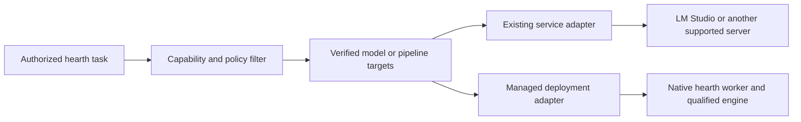

# ADR 0006: managed runtimes and existing inference services

Status: accepted direction, updated 13 September 2026. Existing-provider chat, ordered capability routing, one image job provider and an optional native TLS connector are implemented in the development reference. Managed lifecycle, general orchestration and missing modality adapters remain open. See [current routing evidence](../implementation/CAPABILITY_ROUTING.md) and [the coverage audit](../implementation/DESIGN_COVERAGE.md). The design sections below distinguish the broader target from this implemented subset.

## Context and direction

hearth should connect existing inference services as well as install and manage its own deployments. An administrator who already runs LM Studio, llama.cpp or another supported server should be able to register that service, select a model, verify its features and assign capabilities without replacing the server or enrolling its machine as a managed worker.

The baseline already chooses upstream numerical engines in [architecture](../plan/01-ARCHITECTURE.md). However, [central management](../plan/11-INSTALLATION-AND-CENTRAL-MANAGEMENT.md) assumes centrally managed local deployments, and [first-provider setup](../plan/12-ADMIN-AGENT-AND-FIRST-PROVIDER.md) currently has only local-head, joined-member and OpenAI paths. Existing services need an explicit fourth path. Preserve those original documents and paths while specifying this extension here.

hearth continues to own identity, permissions, capability contracts, durable tasks, routing, artifact access, approval, accounting and its managed worker protocol. The inference engine is replaceable. A qualified llama.cpp service can be one managed text backend; it must not define the universal interface for images, audio or geometry.

## Connection and ownership modes

| Mode | What the operator supplies | What hearth controls |
|---|---|---|
| Existing service, direct | A reachable approved endpoint, credentials when required, and a selected model or pipeline | Requests, capability bindings, hearth's queue, feature probes and observed health |
| Existing service, through a native connector | The existing server plus a fixed TLS bridge on that host | Authenticated request connectivity. The current bridge is not enrolled and supplies no host telemetry; enrolled connectivity/telemetry remain future work |
| Hearth-managed deployment | A supported machine and an approved installation plan | Signed dependencies, installation, supervision, model lifecycle and resource reservations, as qualified for that recipe |

Installing a connector does not transfer ownership of an existing process or grant permission to download, load, unload, evict or upgrade its models. Backend-specific lifecycle controls can be an explicit later opt-in. Generic OpenAI compatibility is not a model-management protocol. LM Studio documents native model-management APIs separately from its [OpenAI-compatible endpoints](https://lmstudio.ai/docs/developer/openai-compat).

Management mode, API protocol and execution locality/billing are separate attributes. An OpenAI-compatible endpoint can be local, remote or a proxy to a paid service. Neither a private address nor the protocol name proves local execution or zero cost.

### Multiple instances are a core requirement

The user's 13 September follow-up makes the acceptance requirement explicit: an administrator must be able to add three or four LM Studio servers on different machines, each retaining its selected model, and route capabilities across them without provoking model swaps. This applies to every supported provider family. Protocol/type is not a singleton identity. Several targets can serve one capability, one target can serve several capabilities, and the same model identifier on separate connections remains independently addressable. Independent GPUs have independent admission groups; shared hardware is grouped deliberately.

The initial report exposed a combined add/edit form and global default group. The subsequent [multi-provider slice](../implementation/MULTI_PROVIDER_RESIDENCY.md) adds explicit Add server/Add model actions, per-host capacity defaults and opt-in LM Studio loaded-instance preflight. Four concurrent loopback HTTP specialists and browser registration fixtures pass. The complete admin/connector/residency journey on physical hosts remains open. External model listing is not residency proof; automatic-loading configuration remains operator-declared. See [the acceptance cases](../implementation/DESIGN_COVERAGE.md#same-type-provider-registration-and-resident-models). This clarification strengthens the existing-service requirement without changing the immutable original specification.

## Distributed residency is the default

The user's further clarification on 13 September 2026 establishes the preferred placement: different specialist models stay loaded concurrently on different machines. The head coordinates the farm and sends each request to the machine already hosting a suitable model. Downloading several models onto one machine remains an optional arrangement when its capacity and the operator's choices support it. The current LM Studio and image service sharing one development GPU demonstrate integration only; they are not the target deployment topology.

Route capability requirements through qualified model/pipeline targets to their provider connections and host resource groups. Filter by permissions, execution policy, feature evidence, residency assurance, freshness and available capacity before selecting a target. Preserve the many-to-many mappings: one resident model can satisfy several capabilities, and a capability can have several independent resident choices. Independently resourced machines can work concurrently; tasks with dependencies still wait for their inputs, and services sharing hardware retain shared admission limits.

The normal request path should use an eligible resident target, choose another eligible resident target, or report/queue unavailable capacity according to explicit policy. It must not silently turn a route into a model download, cold load or eviction. Provisioning, warming and lifecycle changes belong to explicit setup or management plans; existing-service ownership and consent rules still apply. Some media pipelines require staged loading: record that lifecycle and its startup cost as a distinct qualified profile rather than claiming the whole pipeline is permanently resident. A server that can automatically load models needs verified configuration or adapter enforcement before it qualifies for resident-only routing. Unknown residency stays visible as unknown.

The latency objective is to avoid repeated model loading and keep routing overhead low. Measure routing/admission time, queue time and time to first output separately, recording residency and any load or eviction events. Network transport, prompt processing and inference still contribute to latency; "line speed" is a responsiveness goal, not an established throughput guarantee. The loaded-instance preflight implements part of this policy. Live candidate inventory, managed reservations and real multi-host acceptance remain open.

## Routing objects

Use four explicit concepts rather than making a capability point straight at a machine:

1. **Provider connection:** adapter protocol/version, approved base URL, credential reference, TLS trust policy, operator-declared execution boundary, cost policy and optional connector identity.
2. **Model or pipeline target:** exact provider model identifier or approved workflow revision, observed version/digest when available, feature evidence, management ownership and resource-pool identity.
3. **Capability binding:** a capability's required schema/features mapped to one or more eligible targets, with priorities and authorized fallback policy.
4. **Resource pool:** a shared concurrency/admission boundary, such as one GPU or one externally managed service queue. All targets sharing that resource must share its limit.

For example, writing and summarization can share one model in an existing LM Studio server, while coding uses a different target on another machine. One server can expose several models; one model can satisfy several capabilities. A capability can have multiple qualified targets. None of these mappings requires one model copy, process or GPU reservation per capability.

Composing a workflow across N machines means dispatching its eligible tasks or stages to those targets. It does not imply splitting every model across N machines. A backend that itself supports distributed inference can later appear as one target.

Preserve the existing policy-before-selection and validation-after-selection boundaries in [ADR 0001](0001-foundation-and-upstream-adapters.md). Media remains a typed dispatcher; an LLM routing library does not become a universal media executor.

## Verification and truthful readiness

An HTTP response or model listing proves connectivity only. Probe the selected model through the selected adapter using bounded synthetic input. Record capability-specific evidence for chat, streaming, a complete tool-call/result exchange, structured output, vision or embeddings as applicable. Declared context limits need explicit provenance and conservative bounds; a short prompt cannot establish the maximum context window. Protocol success also does not establish task quality, which remains a separate qualification suite.

LM Studio exposes several compatible endpoints, while Ollama explicitly describes compatibility with parts of the API. These are useful common transports, not guarantees that every model implements every feature. [LM Studio documentation](https://lmstudio.ai/docs/developer/openai-compat), [Ollama documentation](https://docs.ollama.com/api/openai-compatibility).

Keep configured, inference-verified and admin-agent-ready distinct. A chat-only model may serve chat while Administration states that admin actions are unavailable. Never extract executable admin commands from ordinary model prose as a substitute for a failed tool protocol.

Evidence must identify the connection revision, selected model/workflow, adapter version, observed identity, probe suite and time. Connection, model, workflow or relevant configuration changes invalidate affected evidence; health expires independently. If an external server cannot attest its weights or resource usage, show those values as unknown. A provider's echoed model name is not a verified weight digest. Do not manufacture signed-package evidence or enrolled-worker observations for an external service.

## Shared resources, failure and cancellation

For an externally shared GPU, hearth can limit only the work it submits. Other clients may consume memory or change the loaded model. Start with conservative concurrency and classify overload and model-unavailable responses. Multiple URLs or capabilities pointing to the same known resource pool must not multiply its slots. Unknown topology must not be presented as exclusive capacity.

Managed workers can report measured free memory, reservations and process lifecycle. An optional connector can improve observations for an existing service, but telemetry alone does not grant exclusive ownership or make a race-free reservation.

Declare cancellation strength per adapter. Closing a stream can stop hearth receiving output while computation continues upstream. A service-wide interrupt must not cancel another user's job. If a backend has no scoped cancellation or job lookup, report that limitation and retain conservative in-flight accounting until completion or a defined reconciliation policy resolves it. A client timeout is not evidence that GPU memory was released. Do not automatically resubmit an expensive request whose outcome is unknown or silently duplicate partially streamed output.

Stage-per-process execution can be useful for managed media. Process termination applies only to hearth-owned, job-scoped process trees, with exit confirmation and artifact validation. Persistent text servers can retain models to avoid loading on every turn. Do not impose one lifecycle policy on every backend.

## Connectivity, privacy and isolation

Only an authorized administrator can register a provider connection. User prompts and tool outputs cannot supply arbitrary inference URLs, credentials or local paths. Store credentials as protected references; browser requests go through hearth's authorized backend, never directly to the inference server.

Connection validation must account for approved private addresses, redirects, DNS changes, metadata-service addresses and unintended internal services. Do not follow a redirect with credentials to a different authority. Verified TLS and the optional authenticated connector remain available. The user's 13 September amendment permits direct HTTP for existing private-network providers after explicit administrator risk acceptance on that exact connection, with visible unencrypted status, audit, revocation and evidence invalidation. See [the implemented HTTP decision](../implementation/EXTERNAL_HTTP_PROVIDERS.md). Certificate checks remain enabled for HTTPS; managed runners retain automatic TLS as their intended default.

In the current development layout, localhost inside the Linux appliance is not localhost on the Windows host. A host-local LM Studio server needs an explicit reachable route or a native connector that can reach its loopback socket. Do not silently expose a previously local server to the LAN to solve this.

Local-only eligibility requires an explicitly approved execution boundary with its assurance level recorded. A health probe cannot prove an external server has no downstream cloud connection. Unknown or cloud-backed execution must not silently enter local-only candidate sets. Stronger offline assurances for managed recipes require dependency completeness and enforced egress controls, not just library environment flags. Paid service use retains the existing explicit budget and egress requirements.

hearth scopes task records, conversation state and artifacts by the current principal. Prefer stateless inference requests initially. If an adapter later uses provider-side conversations, bind their opaque identifiers to the hearth owner and never share them across users. External operators may see requests sent to their service; connecting it establishes an explicit data boundary.

## Images and geometry

Use a typed job adapter with submission, progress/status, cancellation semantics, result collection and validation. Its target can be an external workflow service or a managed recipe. Do not force mesh generation into a chat-completion response.

ComfyUI is a candidate for the first external image-workflow adapter because it documents workflow submission, queues/history, outputs and progress transport. Its interrupt semantics still need qualification for shared use. Pin approved workflow revisions and dependencies; arbitrary workflow JSON or custom-node installation is not a user prompt feature. [ComfyUI server routes](https://docs.comfy.org/development/comfyui-server/comms_routes).

Fooocus can remain a compatibility candidate if a supported interface is qualified. It is a weaker choice for hearth's underlying workflow abstraction: its current README describes limited long-term maintenance and an SDXL-focused architecture. This is an integration recommendation, not a claim that existing Fooocus installations are unusable. [Fooocus repository](https://github.com/lllyasviel/Fooocus).

The [local Shapecast inspection](../implementation/SHAPECAST_INSPECTION.md) supports separating reference-image generation, optional view generation, geometry, materials, optional rigging and export. Keep those stages replaceable and persist validated intermediate artifacts so changing a material stage need not regenerate geometry. Image-conditioned editing, multiview input, texture output and rigging are distinct features, not implied by a generic image or geometry label.

Use manifests for independently installable models and their complete dependency closures: source/version/digest, license notices, required settings, formats, supported hardware, measured resource profiles and feature/quality evidence. Reuse weights when authorized and verified; do not copy an entire model bundle just to enable one stage. Fixed model names or unexplained automatic resolution reductions should not become hearth's selection policy. Persist requested and effective settings and obtain the required user choice before falling outside an agreed quality profile.

[ADR 0003](0003-local-geometry-pipeline.md) remains a narrow TripoSR qualification candidate, not a chosen production quality default. Evaluate eligible alternatives on the same references before choosing advertised presets. Keep actual GLB validation, source/model/recipe provenance, access controls and independent import checks regardless of backend. Shapecast's bundled adapters are observations, not hearth qualifications, and its application code has not been copied into this repository.

## Proposed implementation sequence

1. Add an `existing_service` bootstrap path and explicit provider-connection, target, binding and resource-pool records. Extend capability availability to represent verified external targets without fake local deployment IDs. Version the wire contracts, regenerate Go/TypeScript/OpenAPI artifacts and add migration/RLS coverage when implementing this change.
2. Build the Administrator flow: connect service, select model, run bounded probes, review verified features, bind capabilities. Support a first real streamed workspace response through a qualified OpenAI-compatible adapter before expanding runtime installation. A successful chat probe must be useful even when the model fails admin-tool qualification.
3. Qualify an existing local service end to end, including the Windows-host/Linux-appliance network boundary. The reference LM Studio endpoint and GPT-OSS model now pass a real probe and private multi-turn chat test; broader server and LAN qualification remains open. Preserve the local-head, joined-member and explicitly budgeted OpenAI-first paths and the no-NAS/MCP/Graphify prerequisite rule.
4. Add the optional native connector and managed model lifecycle behind the same target abstraction. Then qualify image jobs and local geometry with durable stage outputs and measured shared-GPU behavior.

Acceptance must cover real streaming; model mismatch and feature failure; offline/overload recovery; expired evidence; credential/TLS/redirect handling; cross-user conversation and artifact isolation; several capabilities sharing one pool; uncertain cancellation and retry outcomes; and rejection of unapproved external/cloud execution for local-only work. Media qualification additionally needs real output quality, artifact validation, dependency completeness, interrupted-stage recovery and independent import.

This implementation slice closes no release gate. All 61 gates and the required P8 geometry work remain at their recorded status.

## 13 September implementation update

The user explicitly made Fooocus optional and authorized a smaller hearth-specific image runtime. The first text-to-image job provider now runs pinned SDXL through Diffusers, using offline local safetensors, scoped cancellation and validated PNG artifacts. It shares resource admission with external chat providers. The runtime is a development process, not a signed/enrolled native package; managed distribution and remote connectivity remain open. Fooocus was extracted and inspected but its graphical API is not required. See [notes, channels and image evidence](../implementation/NOTES_CHANNELS_IMAGES.md) and the [runtime recipe](../runtimes/IMAGE_PROVIDER.md). Replaceable geometry/material/export stages and all 61 release gates remain unchanged.

The subsequent [capability routing slice](../implementation/CAPABILITY_ROUTING.md) implements independently editable ordered assignments, text specialist dispatch and immutable admission receipts. An optional native Go connector now provides authenticated TLS to one fixed loopback provider, with explicit per-connection CA trust at the head. It is an external-service bridge without worker enrollment, managed lifecycle or egress attestation. Windows/Linux loopback TLS checks pass; no multi-host readiness is claimed. Intended assignments for missing vision/audio/memory/geometry adapters remain visible and ineligible for execution.
