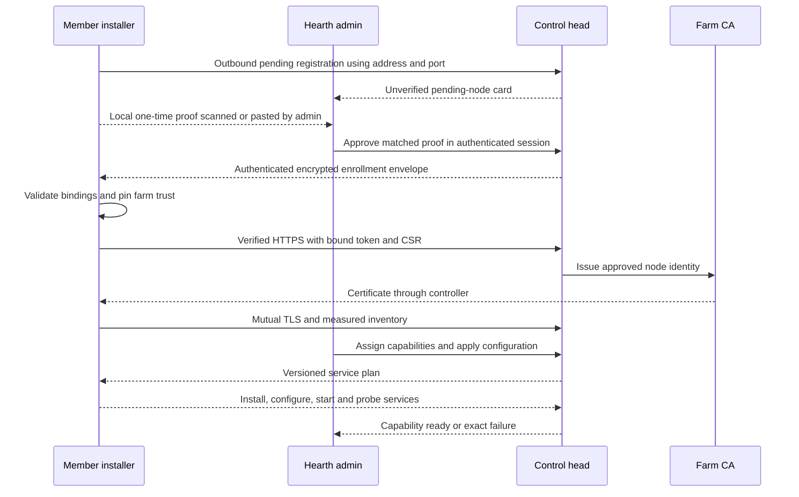
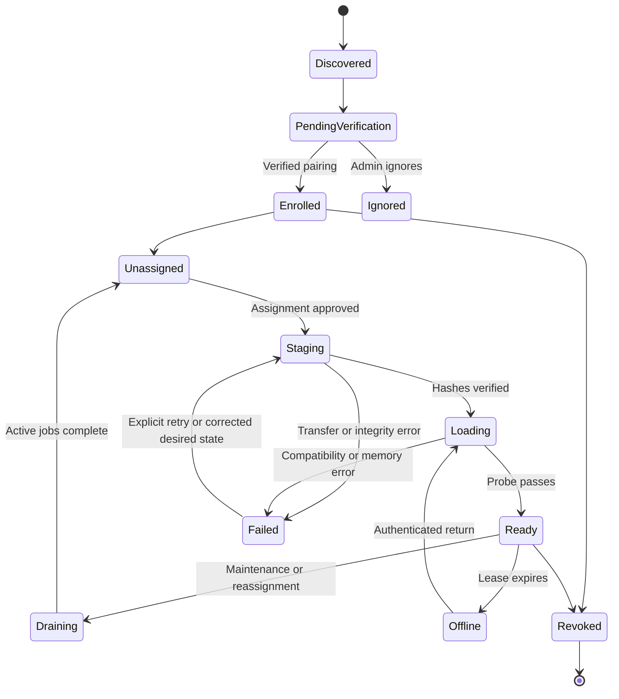

# Discovery, enrollment, and worker lifecycle

## Experience

The first Hearth installer creates the control head. A member installer accepts only its address and port, starts a native background service, and makes a pending-node card appear in the admin application. It displays a local one-time proof for approval in Hearth. After enrollment, the administrator selects capabilities; Hearth centrally provisions the appropriate packages, models and settings. Returning installations restore their identity and assignments automatically.

The complete installer, bootstrap cryptography and NodePlan contract is in [11-INSTALLATION-AND-CENTRAL-MANAGEMENT.md](../../plan/11-INSTALLATION-AND-CENTRAL-MANAGEMENT.md). This revision replaces manual join-bundle transfer. Pairing is performed once per installation; IP and hostname are never node identity.

## Discovery mechanism

The primary join path is an outbound pending registration and polling connection to the supplied head address/port. It works when multicast is blocked and across permitted routed LANs. Advertise the head using DNS-SD service `_hearth._tcp.local` on selected private interfaces as optional convenience. An optional `_hearth-worker._tcp.local` observation can assist pending-device display, but no inbound worker listener is required for enrollment or operations. [DNS-SD](https://www.rfc-editor.org/rfc/rfc6763)

Advertisements carry only protocol version, random installation/farm hint, display label, port and public-key fingerprint. Never broadcast the pairing proof, users, models, prompts, secrets, or detailed inventory. Treat all discovery and anonymous registration metadata as untrusted. Deduplicate observations, expire them after 60 seconds, rate-limit per interface/source, cap pending devices at 100 before aggregation, and bound request/response bodies. Discovery cannot trigger arbitrary URL fetches or software execution.

A supplied unreachable address remains pending with useful diagnostics; it must not create or promote a controller. For a returning member, discovery can suggest the same farm's new endpoint, but only its already-pinned identity can authorize reconnection. No subnet scanning, internet rendezvous, UPnP, automatic farm merging or WAN forwarding is required.

## Secure first pairing

Use the high-entropy installer proof and standard JWE enrollment envelope specified in [11](../../plan/11-INSTALLATION-AND-CENTRAL-MANAGEMENT.md). The admin scans/pastes the proof in a stepped-up, authenticated Hearth session. The head encrypts a key/nonce/farm-bound one-use enrollment grant; the waiting member authenticates it and installs its application trust automatically. CSR submission then uses verified HTTPS and enrolled traffic uses mutual TLS. No trust bundle is copied back to the member.

The special anonymous bootstrap transport handles only public metadata and encrypted envelopes. It is isolated from all normal API, package, configuration, model and credential clients. Never offer a production global skip-TLS checkbox. Detailed inventory and all service provisioning wait for verified mTLS enrollment.

## Certificates and revocation

Node certificates live 24 hours and renew after 8 hours while the node is authorized. Runtime authorization also checks the current node record and assignment on every job/model request. Revocation is an immediate application decision; do not rely on certificate expiration alone. Close existing control streams, reject grants, and remove deployments from routing within 5 seconds. Recheck authorization during long downloads at least every 5 seconds or bounded chunk boundary.

Keep the root CA offline after bootstrap; protect the online issuing intermediate on the controller. Rotate through a documented dual-trust window. Loss of the private worker key requires re-pairing. A copied node identity connecting twice triggers quarantine and an admin event, rather than silently operating as two machines. Certificates authenticate the installed agent, not the integrity of every program on its host.

## Lifecycle

Node and deployment states are separate database fields; the diagram illustrates their combined user flow. A healthy node may have a failed deployment and a working toolbox role. Never mark all its capabilities ready merely because the agent heartbeat is alive.

## Inventory and reconciliation

Report OS/architecture, agent version, runtime package hashes, GPU vendor/device/driver, dedicated memory total/free, RAM, local cache capacity, power state where supported, and engine probe results. Inventory remains sensitive operational data, visible to authorized administrators only. Total memory is stable inventory; free memory is a changing scheduling input.

Use the NodePlan service-recipe reconciler in [11](../../plan/11-INSTALLATION-AND-CENTRAL-MANAGEMENT.md), desired-state revisions and monotonically increasing node epochs. A worker acknowledges each command ID once, persists deployment intent, and resumes verified downloads after a restart. Commands contain typed operations such as `reconcile_plan`, `stage`, `load`, `drain`, and `unload`; never arbitrary shell strings. Full service installation/configuration follows approved recipes, and independent observed states distinguish downloading, installing, configuring, warming, and readiness.

Each job carries a lease and attempt fencing token. A late result from an expired attempt cannot overwrite the current task. Heartbeats are every 5 seconds, stale at 15 seconds, offline at 30 seconds. The stale state immediately excludes a node from new routing decisions. Ready registration also requires an independent engine health probe and model identity check.

On sleep or graceful stop, drain and announce unavailability. Abrupt laptop sleep is handled by lease expiration. Reconnection refreshes inventory and readiness before routing resumes. Power policy defaults to inference only while plugged in; operators may override this per node. Do not change OS sleep or firewall settings without the installation workflow presenting the exact change.

## Placement

An assignment maps a capability to a deployment profile, which selects an approved model revision and compatible engine package. Auto-selection ranks only compatible approved artifacts; use per-capability measured quality, then fit, then observed latency as tiebreakers. Unknown quality is labeled unmeasured. Allow an explicit model pin.

Reassignments drain first. Keep pinned models resident. At most two NAS downloads run concurrently across the reference farm; use configurable throttling. Memory admission and deployment uniqueness are transactional so two admin clicks cannot reserve the same GPU twice.

## Required negative scenarios

Spoofed advertisement; changed key behind the same hostname; expired or replayed pairing envelope; wrong proof or rogue head; token presented with another CSR; forged readiness; stale epoch; duplicate identity; revoked active download; DHCP change; multicast unavailable; disk full; laptop sleep during generation; controller restart during load. Expected results and evidence IDs are defined in [validation](../../plan/09-VALIDATION-AND-RELEASE.md).
