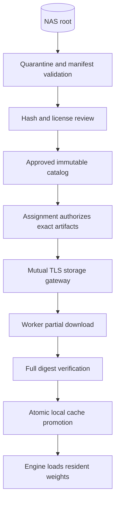

# NAS, model catalog, and artifact delivery

## Storage layout and access

The connector and all node storage/runtime settings are configured through the Hearth admin interface. Capability assignment resolves a signed service recipe, automatically provisions its packages and dependencies, and then stages the model artifacts described here. The managed control appliance hosts the default Linux NAS gateway. Members supply only the head address/port during installation and never need a local NAS mount or runtime configuration. See the binding [central provisioning contract](../../plan/11-INSTALLATION-AND-CENTRAL-MANAGEMENT.md).

Revision 1.2 adds an optional head-local model library behind the same catalog/gateway interface so the [first-provider wizard](../../plan/12-ADMIN-AGENT-AND-FIRST-PROVIDER.md) can work before NAS setup. Use an approved managed root, immutable hashes, quarantine/license approval, scoped downloads and the same runtime dependency rules. Authorized imports or centrally approved repository downloads do not grant workers repository credentials or arbitrary host filesystem access. Once NAS is configured it can become the authoritative library; migrate references by content identity and retain verified cache copies without restarting a healthy deployment solely because its storage source changed.

The NAS library is the authoritative source for approved model artifacts. A Linux storage gateway holds a dedicated read-only NAS credential and exports application-authorized HTTPS downloads. Approved nodes can obtain their assigned models through this service. Nodes do not mount the model share directly or receive its password.

Keep model storage, user knowledge, and generated artifacts in distinct shares or credential-isolated roots:

```text
models/                    # gateway read-only; curator imports separately
  manifests/
  blobs/sha256/<digest>
knowledge/                 # knowledge service write access only
  users/<opaque-user-id>/vault/
  workspaces/<opaque-workspace-id>/vault/
artifacts/                 # application service only; scoped access via IDs
  <workspace-id>/<artifact-id>/
backups/                   # backup identity, separate retention policy
```

No browser user or general inference worker receives a mount of the complete knowledge share. Administrators can grant an individual a personal/workspace export for Obsidian. A folder boundary is not, on its own, a multi-user authorization mechanism.

## NAS setup wizard

1. Choose a gateway node and enter the NAS hostname, share, subdirectory, and dedicated account, or select an existing secured OS mount by registered mount ID.
2. Test DNS/network reachability, authentication, encrypted transport, read access, and denial of write access. Show actionable errors separately.
3. Register the root and import manifests into a quarantine catalog. Do not load or execute discovered files.
4. Verify artifact hashes, formats, licensing metadata, and compatible runtime packages before approval.
5. Show free gateway cache space, model totals, and reachable nodes.

Reference transport is SMB 3 with encryption and authenticated integrity required. Configure signing requirements as well; encrypted SMB messages already provide integrity, so validate the negotiated protection rather than falsely demanding a separate signature on every encrypted packet. If the NAS cannot meet those requirements, fail the connector test and explain the missing feature; do not silently downgrade. Advanced deployments may register a pre-mounted NFSv4 share with Kerberos privacy protection. Plain AUTH_SYS NFS and guest SMB are excluded from the supported secure profile. [SMB security reference](https://learn.microsoft.com/en-us/windows-server/storage/file-server/smb-security)

The web application never runs `mount` itself. An optional minimal privileged helper accepts a validated mount specification from the controller, permits only configured NAS hosts/roots, uses fixed argument arrays and root-only credential files, and returns an opaque mount ID. The gateway remains unprivileged. A documented manually configured read-only mount is a supported alternative when the helper is unavailable.

## Manifest contract

Each immutable artifact revision has a machine-validated manifest. YAML below illustrates the contract to implement, not configuration for an existing Hearth binary.

```yaml
schema_version: 1
model_id: example-code-model
revision: example-revision-1
display_name: Example coding model
status: quarantined
source:
  publisher: example-publisher
  repository: https://example.invalid/model-repository
  immutable_revision: replace-with-verified-source-revision
license:
  identifier: replace-with-reviewed-license
  reference: license.txt
  accepted_by: null
capability_tags: [chat.general, code.explain, code.implement]
format: gguf
quantization: Q4_K_M
files:
  - relative_path: model.gguf
    sha256: REPLACE_WITH_64_HEX_DIGEST
    size_bytes: 0
runtime:
  adapter: llama_cpp
  package_id: replace-with-approved-runtime-package
  minimum_protocol: 1
features:
  input_modalities: [text]
  output_modalities: [text]
  tool_calling: unverified
  structured_output: unverified
  tokenizer_ref: embedded
  chat_template_ref: embedded
profiles:
  - id: conservative
    context_tokens: 8192
    max_parallel_sequences: 1
    weights_bytes: 0
    kv_cache_bytes: 0
    workspace_bytes: 0
    required_free_vram_bytes: 0
    measurement_status: unmeasured
```

Zero sizes and placeholder digests in examples deliberately fail activation validation. Source URLs are metadata, not permission for a worker to fetch arbitrary locations. The initial system ingests models already present on the NAS; an optional curated download/import workflow requires explicit administrator action and source allowlisting.

The full record also includes language tags, adapter/LoRA dependencies, projector or encoder dependencies for multimodal models, hardware constraints, evaluation reports, license restrictions, provenance, and maximum supported context. Model and runtime packages have separate approval records. Parameter count and quantization are insufficient to calculate safe runtime memory.

## Integrity and secure delivery



The controller signs an approved manifest containing all file digests. A worker verifies both catalog approval and every artifact digest before loading. Resume downloads use byte ranges and a stable object revision; any changed NAS file creates a new quarantined revision. A malicious replacement on the NAS must never inherit old approval.

Download authorization is bound to node identity, active assignment, artifact digest, and short expiry. Serve via mTLS plus an authorization header; avoid bearer tokens in URLs and logs. Recheck node revocation during streams. A resumed request obtains fresh authorization. Never authorize arbitrary client-supplied filesystem paths.

Canonicalize and constrain root paths, reject symlinks/reparse points escaping the root, prevent traversal and archive extraction escapes, and handle case-insensitive filesystems safely. Size limits and free-space checks precede transfers. Preserve partial downloads in a non-loadable directory and atomically promote only verified files. Hashing alone does not make an unsafe model format safe: disable pickle loading and `trust_remote_code` by default; custom code requires an isolated, separately approved runtime package.

## Local cache and memory

Default cache quota is administrator configurable per worker, initially 100 GiB or available free space minus 20 GiB, whichever is smaller and nonnegative. Do not silently consume the user's entire laptop disk. Pinned assignments retain their blobs. Evict only unreferenced verified cache entries by least-recent use. In-flight transfers and loaded dependencies are not eviction candidates.

Model transfers are startup work. Generation uses local resident memory; NAS throughput is not part of the intended per-token path. The gateway can cache immutable model blobs to avoid repeatedly reading the NAS. When the NAS is unavailable, verified local models may continue serving. New missing downloads wait with a clear storage-unavailable state.

Before readiness, run a model-specific load probe at the configured context and concurrency, verify actual GPU placement, and measure peak VRAM and latency. Use a conservative admission estimate before the probe. An OOM leaves the deployment failed, does not thrash through repeated restarts, and offers a smaller profile/model. Display partial CPU offload explicitly if the admin chose it.

Revoking a node stops future access but cannot retract model bytes already downloaded to a host. The admin UI must distinguish authorization revocation from a best-effort cache wipe. This also applies to artifacts already seen by a worker.

## Generated artifacts

Artifacts are addressed by opaque IDs, with user/workspace ownership, content type, size, digest, source task, and retention status. Uploads are bounded and authorized for the active job; downloads are authorized on every request, including byte ranges. Serve risky HTML/SVG or other active content as downloads or inside an isolated origin. Never render arbitrary tool output as trusted application markup.
