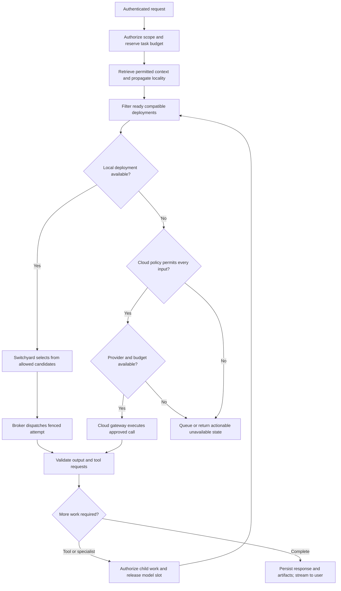
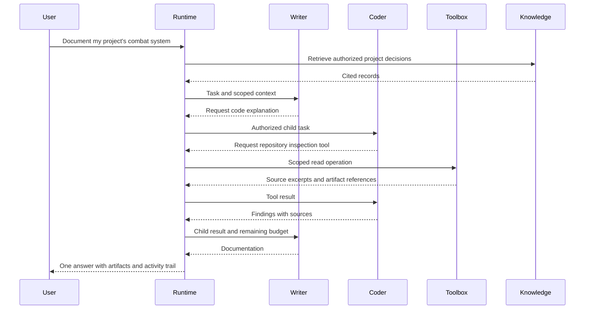

# Agent runtime, routing, cloud fallback, and shared tools

## A capability is an executable contract

Seed the catalog with `chat.general`, `reason.plan`, `code.explain`, `code.implement`, `write.compose`, `text.summarize`, `data.extract`, `vision.describe`, `image.generate`, `geometry.generate`, `audio.transcribe`, `audio.speak`, `memory.retrieve`, and `memory.index`. Infrastructure roles are `toolbox`, `knowledge`, and `storage_gateway`; show them in administration without pretending they are ordinary chat models. The internal `admin_assist` workflow is admin-only and cannot be requested through the public capability API.

Every capability definition specifies input/output schemas, required modalities, context limits, model features, agent recipe, permitted tool categories, quality suite, default resource budget, and provider fallback eligibility. Definitions are versioned and admin-approved. Tags help discover candidates; measured evaluations and successful compatibility checks determine eligibility.

## Request flow



Tool work dispatches to the toolbox instead of following an LLM route. The return arrow in the diagram represents resuming the parent task with authorized results; every subcall rechecks permissions and budget.

## Durable runtime

Maintain a task tree and event stream in PostgreSQL. State transitions and an outbox event commit in the same transaction. Executors claim jobs using row locks and leases; notifications reduce polling latency but the database is authoritative. A crash after notification cannot lose accepted work.

Task states: `queued`, `running`, `waiting_child`, `waiting_tool`, `awaiting_user`, `completed`, `failed`, `cancelled`. An attempt has its own lease, worker ID, deployment revision, fencing token, start/end timestamps, and error classification. Store partial generation as interrupted when a worker disappears. Do not splice a new model's unrelated continuation into an old stream as if it were uninterrupted.

Persist parent state before dispatching children. Release the inference generation slot while waiting; preserve conversation/task state in the runtime. A resident model can remain loaded. A parent must not hold the only GPU slot while a child needs that same deployment. Parent and child may use the same model without requiring duplicate residency.

Default limits: delegation depth 3, at most 8 child tasks per user turn, at most 2 concurrent child tasks per turn, 12 model/tool iterations, and 5 minutes for text tasks. Media deadlines default to 15 minutes. All are configurable within farm/user ceilings. Reject a child whose normalized task signature and target repeat an ancestor without new evidence; enforce depth limits regardless of signature matching.

## Specialist consultation

Expose a typed runtime tool, not raw peer networking:

```json
{
  "capability": "code.explain",
  "instruction": "Explain how authentication works and cite the implementation.",
  "input_artifact_ids": ["artifact-repository-snapshot"],
  "expected_output": "findings_with_sources",
  "deadline_seconds": 120
}
```

The tool schema excludes user IDs, roles, provider secrets, and permission flags. The runtime supplies trusted parent identity, resource scope, locality, depth, and remaining budget. Results contain findings, source references, uncertainty, artifact IDs, execution provenance, and status. A specialist cannot claim a source reference it was not authorized to access; validate IDs before exposing them.



The coordinator remains responsible for task state, while the lead agent is responsible for composing the answer. The UI shows concise activity such as “Consulting coding specialist”; it does not expose private internal reasoning.

## Switchyard integration

Define `Router.select(request_profile, eligible_candidates) -> route_decision`. Keep provider-specific schemas inside adapters. Pin the library version and write a real contract test using at least two fake inference endpoints plus a later real worker test. Capabilities and unavailable services remain Hearth concepts even if upstream routing APIs change.

The initial policy chooses a healthy resident local candidate, ranked by capability quality and available queue capacity. Switchyard can add classifier or staged selection after its own cost/locality checks. If the library errors, fall back to the deterministic selector over the already-authorized candidate set. Never broaden eligibility during an error fallback.

Prefer session affinity while the selected worker remains suitable. Reevaluate between model calls or workflow steps. A failure after partial output is an interrupted attempt with a visible retry, not an invisible provider switch.

## OpenAI overflow

The first-provider wizard may explicitly select OpenAI as the initial `admin_assist` provider before local inference exists. This is a separately consented administrative route, not a change to ordinary-user fallback defaults. Bring the minimal complete gateway and its safeguards into P4; P5 expands routing. Admin management tools execute locally through the protected facade, and every model-visible result passes the cloud gate. [Binding first-provider contract](../../plan/12-ADMIN-AGENT-AND-FIRST-PROVIDER.md)

Implement OpenAI as a provider adapter through the dedicated cloud gateway. Use the official SDK and Responses API for text/tool-call generation, and the appropriate documented API for supported image/audio capabilities. Model IDs are admin-configured and validated against the account and a test request. Do not hardcode “latest” aliases as permanent capability definitions. [Responses integration reference](https://developers.openai.com/api/docs/guides/migrate-to-responses)

Cloud fallback triggers when no healthy, policy-compatible local deployment serves the requested capability. A merely busy worker normally queues locally; overflowing on queue delay is a separate opt-in policy, initially 30 seconds. A model staging from NAS is shown as warming. If fallback is authorized, a request may use cloud without waiting for that load; that does not change the local assignment.

Default user preference is local-only. After the administrator configures provider and budget, a user can select **Prefer local; allow OpenAI when needed** once for future eligible conversations. Show a persistent cloud badge and per-request provider/usage record. Per-source locality and workspace restrictions still take precedence. If blocked, return a typed reason such as `cloud_not_allowed`, `local_only_context`, `budget_exhausted`, or `no_provider_for_modality`.

Keep chat state locally and send a minimized authorized context for each provider call. Use `store=false` where supported and avoid provider background mode by default; Hearth owns its own background tasks. `store=false` is not a promise that the provider retains no data. [Data controls](https://developers.openai.com/api/docs/guides/your-data)

Reserve worst-case configured cost for each call transactionally before dispatch; reconcile measured usage afterward. Parent and child calls share one budget. Refuse unknown-price models until a price schedule is configured. Rate limits and 429s use bounded retry with jitter and deadline enforcement. Disable SDK automatic retries for calls whose completed/billable outcome could be uncertain; Hearth's adapter classifies retries explicitly. A transport failure with unknown billable outcome remains an unsettled reservation until reconciliation/expiry policy resolves it. Never promise exactly-once provider billing or replay an uncertain paid request automatically.

Do not send cloud models direct access to internal MCP endpoints. They return ordinary tool-call requests; Hearth validates and executes these locally. A tool result returned to a cloud model is itself an export and must pass locality checks. A model asking for tools does not receive provider credentials or general NAS paths.

## Shared MCP toolbox

The [admin agent](../../plan/12-ADMIN-AGENT-AND-FIRST-PROVIDER.md) has a separate fixed management facade supplied by the control plane. Its setup capability does not depend on this toolbox, and its tools must not be published into the ordinary MCP/user registry.

The designated toolbox node runs an MCP host and approved server packages. The runtime sends scoped tool invocation envelopes. The host connects to local stdio servers or authenticated remote Streamable HTTP servers using official SDK support. MCP supplies protocol interoperability; Hearth supplies caller authorization, task ownership, scheduling, and policy. [MCP architecture](https://modelcontextprotocol.io/docs/learn/architecture)

Store a tool catalog with server/package revision, schema digest, input/output schema, read/write/execute classification, connector identity requirements, workspace permissions, allowed network destinations, timeout, idempotency behavior, and audit policy. Expose only relevant allowed tools to a model; large tool catalogs use a discovery tool with the same filtering.

Three execution classes:

| Class | Default behavior |
|---|---|
| Read-only | Execute when the caller has resource access |
| Reversible write in assigned workspace | Execute under standing workspace permission with revision checks |
| External message, destructive action, privilege change | Require a recorded explicit grant for the exact action/scope; otherwise surface an approval item |

Approval is checked by the runtime, never inferred from model text. Tool-call IDs and idempotency keys are persisted before execution. Pure reads can retry. For uncertain external side effects, query status or require reconciliation; do not replay blindly. Cancellation propagates to child jobs but cannot undo an already completed external action.

Prefer per-user connector credentials. Shared connectors declare their administrative scope and cannot be substituted for a user's missing permission. Each invocation carries an authenticated user/workspace/task context; do not accept those fields from the LLM's arguments. Audit metadata records who caused an action, which agent requested it, and which connector executed it.

If an MCP server keeps credentials or state in its process environment/session, pool instances by user, workspace, connector identity and approval revision. Do not reuse that process across unrelated users. A single shared server is acceptable only when the adapter can enforce authenticated per-request isolation; passing an untrusted `user_id` argument is insufficient.

## Availability semantics

Capabilities expose desired assignment, local health, cloud configuration, and caller eligibility as separate fields. Global admin state must never say that a particular user can use cloud unless their policy permits it. “Assigned” is not “Ready.” A capability can be locally offline and cloud-eligible for one user but unavailable for another.

Local inference, retrieval, and local tools must continue when the internet is disconnected. If the controller or database is unavailable, workers reject new unauthenticated commands; active safe inference may finish into bounded local result storage and await reconciliation. Side-effect tools stop initiating actions when authorization cannot be checked.
