# Rendered diagram gallery

These SVGs are rendered from the Mermaid source blocks in the linked Markdown documents. The source documents are authoritative.

## Farm architecture

[Source document](../../../plan/01-ARCHITECTURE.md)

## Secure node pairing

[Source document](../../../plan/02-DISCOVERY-AND-WORKERS.md)

## Node and deployment lifecycle

[Source document](../../../plan/02-DISCOVERY-AND-WORKERS.md)

## NAS model approval and delivery

[Source document](../../../plan/03-NAS-AND-MODELS.md)

## Request routing and cloud fallback

[Source document](../../../plan/05-RUNTIME-ROUTING-AND-TOOLS.md)

## Specialist consultation sequence

[Source document](../../../plan/05-RUNTIME-ROUTING-AND-TOOLS.md)

## Authorized conversation retrieval

[Source document](../../../plan/06-MEMORY-AND-KNOWLEDGE.md)

## Deletion and derived-data cleanup

[Source document](../../../plan/06-MEMORY-AND-KNOWLEDGE.md)

## Administrator node setup flow

[Source document](../../../plan/07-INTERFACES.md)

## Central service provisioning

[Installation and central management](../../../plan/11-INSTALLATION-AND-CENTRAL-MANAGEMENT.md)

## First-provider wizard and admin agent

[First-provider and admin-agent contract](../../../plan/12-ADMIN-AGENT-AND-FIRST-PROVIDER.md)

## Authorized administrative action sequence

[First-provider and admin-agent contract](../../../plan/12-ADMIN-AGENT-AND-FIRST-PROVIDER.md)

## Video review: planning, execution, and review workflow

[Video review](../../../plan/VIDEO-REVIEW-IH8XmxiwliQ.md)

## Proposed shared-model replicas and role caches

[Video review](../../../plan/VIDEO-REVIEW-IH8XmxiwliQ.md)

