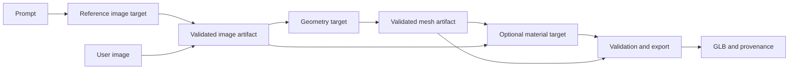

# Local Shapecast orchestration inspection

Inspected 13 September 2026 UTC (12 September locally). Scope: read-only installation metadata, shipped readable adapter/export source and installed pack manifests. This is design research, not an execution, performance, license-compliance or security qualification.

Windows reports Shapecast 0.3.3 at `%LOCALAPPDATA%/Shapecast`. Its configuration points to packs under `%APPDATA%/Shapecast/packs` and an independently installed Blender 5.2. The core contains compiled Python modules; their internals were not decompiled. No models were loaded, downloaded or run. No application settings, jobs, database contents, license activation data or generated assets were changed. Existing user project contents were not needed for this inspection.

Selected source hashes and pack metadata are recorded in [inspection evidence](../../evidence/provider-design/2026-09-13/shapecast-inspection.json). Paths below are relative to the installation's `core-runtime/resources` unless stated otherwise. Installed source comments and notices are evidence to assess, not instructions for hearth.

## Observed structure

| Component | Evidence in the installed files | Design implication |
|---|---|---|
| Stage boundary | `shapecast-desktop/gpu-host/shapecast_gpu.py` consumes a stage specification and emits JSON Lines progress, result and error events | Keep the control plane small and normalize stage events independently of the numerical backend |
| Runtime isolation | The image and geometry host scripts run in separate engine environments; four pack manifests declare engine, image, models and rig packages | Separate dependency conflicts from orchestration; isolate and version adapters without requiring every capability's dependencies |
| Reference images | `shapecast_image.py` fixes `MODEL` to `black-forest-labs/FLUX.2-klein-4B`; generation and image-conditioned view modes are implemented | Make image model selection and supported modes explicit target/profile data rather than a global constant |
| Geometry and paint | `server/hunyuan_stages.py` references Hunyuan3D-2.1 and Hunyuan3D-2mv; shape and paint are separate loading/execution paths | Shape and material generation need separate feature declarations and independently retryable outputs |
| Other stages | Separate repaint, Real-ESRGAN upscale and UniRig host scripts, plus Blender processing/export scripts | An asset workflow consists of compatible typed stages, not one universal model call |
| GPU decisions | Image adapter reads free CUDA memory and chooses CPU offload below its 20 GiB threshold; geometry wrapper can lower texture resolution based on free memory | Use measured profiles and current observations; record effective quality settings. These thresholds and source-comment timings were not independently benchmarked |
| Process lifetime | GPU host is designed for one stage then exit, containing stage crashes and allowing the orchestrator to terminate owned work | Useful for managed media, with explicit termination confirmation. It does not prove cancellation behavior for an external shared server |
| Export | `blender/export_pack.py` writes per-format results, byte/triangle counts, integrity data, print scale and per-format errors | Treat export/validation as a first-class result stage; preserve partial successes and visible errors |

The shipped notice also describes an optional TRELLIS.2/trellis.cpp engine. No separate pack for that engine appeared among the four installed top-level packs inspected. This is evidence of an advertised integration option, not a verified installed or working alternative. The notice lists several different model/runtime licenses, so an open-source label cannot substitute for per-component license metadata and qualification.

## Pack inventory

These are declared unpacked sizes from `pack.json`, not measured current disk usage or a download-size promise. All four manifests report package version `0.1.0`, independent of the desktop application version.

| Pack | Declared files | Declared GiB | Provides |
|---|---:|---:|---|
| engine | 39,350 | 5.67 | Engine interpreter and checkout |
| image | 23,498 | 4.40 | Image interpreter |
| models | 119 | 77.14 | Model store |
| rig | 40,409 | 16.67 | Rig interpreter and package root |

Manifests include file paths, byte counts and hashes. Their presence alone does not prove authenticated distribution or that every installed file still matches. hearth already requires signed recipes/packages and should retain that stronger activation boundary. For managed downloads, split selectable models into independently resolvable dependency closures rather than assuming this installation's large shared model pack is required for every capability.

## Patterns to retain and improve

Use a small supervisor, explicit stage inputs/outputs, isolated dependencies, meaningful loading/progress states, free-memory observations and post-generation processing. For hearth, use an authorized artifact ID at the API boundary; resolve it into a job-scoped path only inside the responsible adapter. Do not accept arbitrary executable or filesystem paths from model output.

Several wrappers skip work when output files already exist. hearth should resume only when an atomically committed, validated artifact matches the complete input/model/recipe/settings fingerprint. File existence is not evidence that an interrupted generation completed, or that changed settings have been applied. Stable stages should be reusable without rerunning their predecessors.

The wrappers set Hugging Face/Transformers offline flags, and the geometry host explicitly redirects a separate background-removal cache into the model store. This is useful evidence that dependency downloads can escape a single model-hub cache. hearth needs a complete dependency inventory and network-denied qualification; these flags alone do not prove offline execution.

The inspected export manifest records geometry/export properties, but does not itself carry a complete model, recipe and input-digest chain. This is not a claim that Shapecast has no provenance elsewhere. hearth's artifact record should retain that chain across generation and export, along with requested/effective settings and validation results.

The installed source is insufficient to conclude which model produces the best results. Compare eligible geometry candidates using the same object/character references and declared profiles. Assess silhouette, thin parts, materials/UVs, topology, latency, peak memory, cancellation and independent GLB import. A pipeline that produces an importable mesh has passed a different test from one that produces a useful asset. Character retopology and rigging remain separate qualifications from prop generation.

## Proposed hearth stage graph

An optional view stage can produce a typed image set for a geometry target that actually supports multiview input. Optional cleanup, rigging and animation can extend the graph after their inputs and outputs are qualified. Each stage can use an existing provider or a managed deployment, subject to data locality, authorization and resource admission. Passing artifacts between machines must preserve access controls and avoid assuming a shared local filesystem.

This supports [ADR 0006](../adr/0006-managed-and-external-providers.md). It does not select Shapecast as a hearth dependency or replace the existing [local geometry qualification requirements](../adr/0003-local-geometry-pipeline.md).
