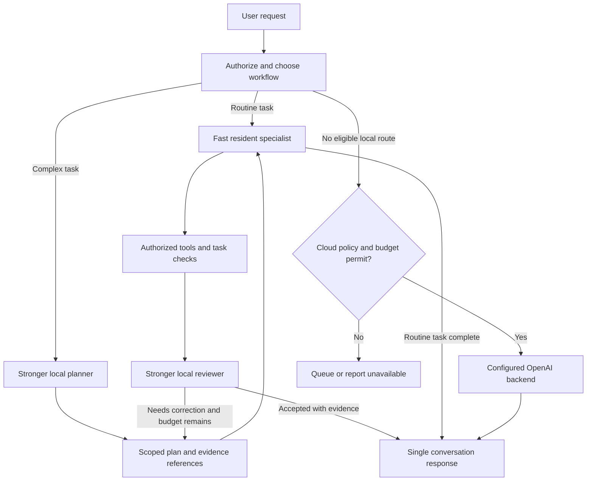
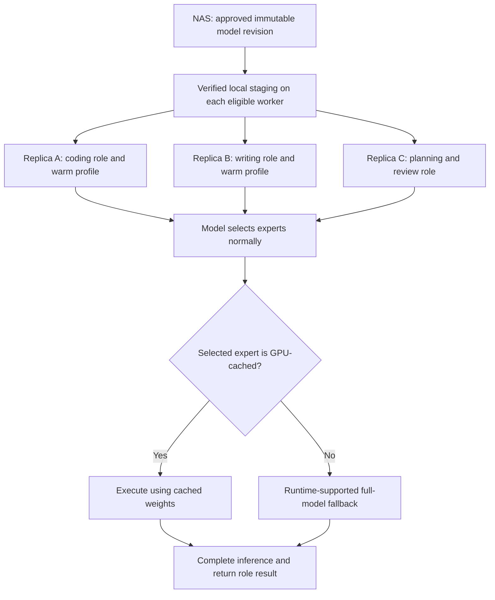

# Video review: hybrid local inference and staged specialist work

Reviewed 12 September 2026. **Status: research review with proposed hybrid-inference and role-cache experiments.** This review does not claim hardware validation. Read it alongside [BUILD_HANDOFF.md](BUILD_HANDOFF.md). The current binding baseline is revision 1.2, including [central installation and management](11-INSTALLATION-AND-CENTRAL-MANAGEMENT.md), separately provisioned media/3D services and the [first-provider/admin-agent flow](12-ADMIN-AGENT-AND-FIRST-PROVIDER.md). Node onboarding must follow the binding installer contract regardless of which model strategy is selected. Baseline phase gates take precedence over older proposed phase changes here.

## Recommendation

Keep the farm architecture. Expand its deployment profiles to include large models deliberately spread across GPU memory, host RAM, and local SSD. Add an explicit planning, execution, and review workflow so a stronger, slower local model can guide a faster specialist on another machine. Evaluate the combination by successful task completion time and correctness.

The existing plan already allows explicitly labeled CPU offload. This proposal makes hybrid inference a supported, measured deployment class with its own admission rules. It does not require splitting a model across machines or deleting experts. Each inference deployment still runs on one worker; workers exchange bounded tasks and results.

## Evidence reviewed

Retrieved and read the complete English auto-generated captions, covering 0:00 through 25:09, for Codacus's [Frontier-Class AI at Home. Is It Finally Here?](https://www.youtube.com/watch?v=IH8XmxiwliQ). Captions can mis-transcribe technical names, so architecture details were checked against the model author's card and runtime documentation. The full transcript is working research material; this document contains the assessment.

| Video section | Creator-reported observation |
|---|---|
| [4:28](https://www.youtube.com/watch?v=IH8XmxiwliQ&t=268s) | RTX 3060 12 GB, Ryzen 5600X, 64 GB installed RAM; an approximately 82 GB three-bit model artifact. |
| [6:53](https://www.youtube.com/watch?v=IH8XmxiwliQ&t=413s) | Expert caching plus six CPU threads yielded about 24.4 generated tokens/second. |
| [7:48](https://www.youtube.com/watch?v=IH8XmxiwliQ&t=468s) | Container memory caps showed roughly 22 generated tokens/second at 24 GB, but only 15 prompt tokens/second. Prompt processing recovered substantially around a 40 GB cap. |
| [21:12](https://www.youtube.com/watch?v=IH8XmxiwliQ&t=1272s) | The larger model's coding tasks took 16 minutes, 40 minutes, and nearly an hour. |
| [21:48](https://www.youtube.com/watch?v=IH8XmxiwliQ&t=1308s) | A larger planner/reviewer directs a faster worker. Switching models on his single machine costs approximately 25 seconds. |

These are the creator's measurements, not Hearth results. Container limits are not equivalent to the same amount of installed system RAM: the host, other processes, page cache accounting, and workload also matter.

Qwen's official card specifies a 125B language model with 6B activated parameters, plus 51B n-gram embeddings and 4B MTP. Its MoE has 512 experts with 10 routed and one shared expert active per layer. The n-gram component uses token combinations to index learned embeddings and is designed to be more amenable to offloading. Parameter-count conventions differ from the video's headline. This does not mean the whole model fits in 12 GB. [Official model card](https://huggingface.co/Qwen/Qwen3.8-Flash-Next)

The published coding lab contains three small Python tasks. Its reported larger-model score matches its cloud comparator on that suite; the smaller model also demonstrates why passing checks can miss a specification violation. This is useful evaluation material, but insufficient evidence for broad frontier equivalence. [Creator's benchmark repository](https://github.com/thecodacus/spec-wins)

The linked runtime wiki explicitly limits its optimized expert-cache branches to CUDA. It also distinguishes RAM-backed cold experts and grouped execution from the mmap path, which has different performance. Its current guidance has evolved beyond the video. Pin and test a branch and commit; do not combine launch flags from different forks. [Runtime wiki](https://github.com/GenerelSchwerz/llama.cpp/wiki), [creator's separate fork](https://github.com/thecodacus/llama.cpp)

## What the mechanism means

The useful distinction is between total stored parameters, parameters consulted for a token, and the placement and execution cost of those parameters. Capacity is still required somewhere, but the fastest memory need not hold everything. A learned lookup table has a different access pattern from expert matrix multiplication. Lookup incurs memory and storage costs even when it avoids substantial computation.

This is close to the original expert-residency idea: keep frequently needed experts in fast memory. The crucial difference is retaining a correct path for other selected experts. Cache hits make the common case cheaper; cache misses must preserve routing semantics. Removing rarely used experts would change the model and require separate quality validation or retraining.

The embedding table is part of a trained model. It is not a human-readable reference library, an Obsidian vault, conversation memory, or a replacement for RAG. Nothing in this evidence establishes that an arbitrary existing MoE can be retrofitted with that table or sliced into equally capable specialist models.

## Proposed workflow

The user's follow-up adds another candidate: deploy the same model on each suitable text worker and vary its role, tools, and expert-cache profile. The workflow below supports either identical-model replicas or different specialist models. Compare both rather than assuming the smaller executor is required.

[Rendered workflow](diagrams/VIDEO-REVIEW-IH8XmxiwliQ-1.svg). The direct routine branch still performs checks required by its capability. Review is not required for every chat response. Each child task passes through the existing authorization, locality, budget, and scheduling controls.

Keeping planner and executor deployed on different machines can remove model unload/reload delays at handoff. It does not remove queueing, prompt processing, network transfer, or the need for sufficient RAM and storage on each worker. The planner and reviewer may share one deployment. This is an application workflow, distinct from the model's MTP speculative decoding.

## Concrete amendments

### Shared model with role-specific expert warming

**Assessment: a sound deployment option for more consistent text behavior, with an unproven incremental speed benefit from role-specific caching.** Consistency comes primarily from sharing model identity, quantization, tokenizer, conversation formatting, common response policy, and authorized memory. Cache contents should affect execution cost while preserving the model's routing choices. They do not add specialist knowledge or make the model agree with another instance. Role instructions, retrieved evidence, stochastic sampling, and numerical differences can still change answers.

There is unusually direct upstream evidence for this proposal. The creator's fork accepts per-layer expert-use profiles and demonstrates separate coding/chat traces. Its README reports that a merged workload profile performs within roughly 1% of specialist profiles in its measurements. That result supports starting with a shared profile; it does not establish that specialization is useless on every model or workload. [Profile capture and cache implementation](https://github.com/thecodacus/llama.cpp#-this-fork--moe-expert-cache-vram-resident-hot-experts)

[Rendered replica/cache flow](diagrams/VIDEO-REVIEW-IH8XmxiwliQ-2.svg). The shared boxes describe the same local execution rule on each worker; they are not a central expert server. Cold execution may occur on CPU or through transfer, depending on the verified engine profile.

Proposed implementation rules:

1. Define a `model_cohort` by exact model artifact and tokenizer/template identities plus quantization and common policy revision. Different hardware may use different approved binaries; test numerical and task-quality compatibility. A differently quantized model is another cohort variant, not an identical replica.
2. Define a separate `warm_profile` keyed by model hash, layer/expert identifiers, runtime cache format, workload-suite revision, and byte budget. The administrator chooses a role; the controller chooses a compatible approved profile and sizes it against that worker's tested memory envelope.
3. Generate profiles from representative, authorized synthetic/public role workloads, measuring prefill and generation separately. Expert IDs are layer-specific. Do not assume a universal set of eight coding experts. Benchmark on different prompts from those used to construct the profile.
4. Default to a shared mixed-workload profile. Permit role profiles and adaptive replacement only through engine features that actually support them. A future policy could combine a common hot set, role-biased entries, and a bounded adaptive portion, but that is new implementation work rather than an existing portable runtime guarantee.
5. Warm before advertising the profile's normal latency class. Observe hit/miss counts, bytes moved, CPU fallback time, memory pressure, prompt latency, and whole-task time. If warming fails, report the actual fallback mode and admit it only if its measured service objective still passes.
6. Let the farm router prefer an eligible warm replica for a role, while allowing another compatible replica to serve overflow. Never bias the model's expert selection toward whichever experts happen to be cached. A cache miss changes placement, not permissions or access to the remaining model weights.
7. Keep weight-cache profiles separate from user prompt/KV caches. Warm-up jobs inherit normal isolation and resource limits. Do not distribute private prompts or conversation traces with a role profile; store aggregate expert counters and approved provenance only.

Each replica still needs a locally staged complete model and adequate host RAM/SSD resources. NAS deduplication reduces library storage and provisioning work; it does not combine worker RAM into a single pool. Identical-model replicas also share likely blind spots, so retain independent task checks and permit a different reviewer when evaluations justify it.

The same-model option does not automatically reproduce the video's faster-small-model executor. Its benefit might instead be consistency, simultaneous availability, and throughput across users. Image generation, transcription, and speech still use suitable modality backends unless the selected common model genuinely supports and passes evaluation for them. Machines unable to run the common model keep useful tools, storage, memory, or smaller-model roles.

Add one P4-H comparison: no expert cache, shared-profile cache, role-profile cache, and supported adaptive cache at equal memory/context budgets. Add one P8 comparison: same-model replicas versus mixed-model planning/execution/review, measured on consistency, correctness, latency, and multi-user throughput. Promote role-specific warming only when its improvement is repeatable and larger than run-to-run variation without sacrificing the declared quality gate.

### 1. Model profiles describe placement, not just VRAM fit

Extend the profile contract in [03-NAS-AND-MODELS.md](03-NAS-AND-MODELS.md) and [08-DATA-AND-API-CONTRACTS.md](08-DATA-AND-API-CONTRACTS.md):

| Field | Proposed behavior |
|---|---|
| `execution_class` | `gpu_resident`, `hybrid_local`, or `cpu`; required and visible in the admin UI. |
| `placement` | Typed component policies for shared weights, experts, n-gram tables, KV/recurrent state, and optional draft model. Unsupported component policies fail validation. |
| `runtime_identity` | Source repository, immutable commit, binary hash, backend, build options, and driver compatibility evidence. |
| `resource_envelope` | VRAM, host RAM including page-cache allowance, CPU capacity, local disk bytes, and supported context/concurrency. Record measured peaks separately from reservations. |
| `expert_cache` | Disabled, approved static profile, or runtime-supported adaptive policy; include size and profile provenance. Cache misses must remain valid model execution. |
| `performance_evidence` | Workload, quantization, context, cold/warm state, prompt rate, output rate, time to first visible answer, task duration, and validation result. |

Keep one active sequence per GPU deployment as the initial default. Admit simultaneous deployments against shared CPU, RAM, disk, and GPU resources together. Do not silently change a resident profile into hybrid mode after OOM.

### 2. Discovery and assignment include the rest of the machine

Extend [02-DISCOVERY-AND-WORKERS.md](02-DISCOVERY-AND-WORKERS.md) to inventory physical/logical CPU topology where available, available host RAM, local cache filesystem, disk capacity, GPU backend, and power state. Run bounded local performance probes after enrollment and assignment; discovery packets must remain minimal and unauthenticated observations must not become trusted inventory.

The admin dashboard should show both job domain and workflow stage. A node can be eligible for coding implementation but unsuitable for long-context code review. Add cards or filters for `plan`, `execute`, and `review` without multiplying every domain into a separate permanent model copy. Assignment is still capability-to-deployment mapping.

Show clear statuses such as **Hybrid local: ready**, **Insufficient host RAM**, **Model not staged locally**, and **Context exceeds tested profile**. An unknown measurement stays unknown, not zero.

### 3. NAS supplies immutable artifacts; local SSD can serve inference

The secure NAS gateway remains the right design. Before a hybrid deployment becomes ready, stage and verify all required model shards and companion files onto a local filesystem. Pin those artifacts against cache eviction while the deployment uses them. Reserve their full logical space and reject network-mounted runtime paths for this profile.

Do not memory-map the NAS over the LAN for per-token access. The NAS can be unavailable after staging without interrupting an otherwise healthy deployment. Hashes, signed manifests, assignment-scoped download authorization, read-only engine access, and per-worker credentials remain required.

Update the existing statement that generation uses resident memory to distinguish resident execution from explicitly admitted local SSD paging. Record sustained read traffic and page-fault pressure; back off or drain before memory pressure destabilizes the host. Never use the OS swap file as a promised capacity tier.

### 4. Routing uses task quality and latency class

Extend [05-RUNTIME-ROUTING-AND-TOOLS.md](05-RUNTIME-ROUTING-AND-TOOLS.md) so eligible hybrid deployments participate in local selection. Filter candidates by authority, locality, modality, tested context, quality evidence, resource availability, and deadline before ranking.

Choose a direct fast route for routine chat. Offer a durable thorough-work workflow for longer jobs. Within the existing user/admin policy, try an eligible stronger local deployment before cloud overflow when its expected completion time is acceptable. A model that technically loads but cannot meet the workload's context or latency requirements does not make that capability meaningfully available.

Do not make a slow model the compulsory front door. Use deterministic workflow policy first and keep Switchyard behind the existing adapter. Estimate completion from queue delay, uncached prompt processing, expected generation, tool work, and child stages. Display estimates as estimates, with measured ranges where available.

### 5. Plans and reviews are typed, bounded task artifacts

Add a versioned workflow recipe in [P8](phases/P8-COLLABORATION-AND-MEDIA.md). A plan artifact contains objective, source snapshot IDs, acceptance criteria, small steps, dependencies, allowed artifact paths, and a task budget. A result contains actual changes and check evidence. A review records verified findings, unmet criteria, and a verdict.

Default to at most two correction rounds within the existing global task budget. A failing review returns concrete unresolved findings when the budget ends. It must not loop indefinitely or broaden cloud/tool permission. The orchestrator validates artifact references and schedules the work; model prose cannot grant authority.

Precise instructions do not remove an executor's capacity to misunderstand or make mistakes. Keep independent checks and specification review. The same model planning and reviewing can repeat the same error, so model agreement is not proof. Do not require or persist hidden chain-of-thought as a workflow contract; use explicit plans, concise rationale, and observable evidence.

### 6. Memory becomes more sensitive to prompt cost

Keep the Obsidian/Graphify design in [06-MEMORY-AND-KNOWLEDGE.md](06-MEMORY-AND-KNOWLEDGE.md). Add a per-profile retrieval budget and progressive retrieval: compact authorized context first, followed by source slices requested for the task. Handoffs include task state and evidence references rather than entire conversations by default.

Summaries retain provenance and restrictive locality labels. Changed source snapshots invalidate dependent summaries. Prefix caches remain isolated by the existing user/workspace authorization boundary. Benchmark cold retrieval and follow-up turns separately; warm prefix reuse must not conceal the cost of new documents or a different user.

## Phase changes and experiment gate

| Phase | Proposed addition |
|---|---|
| P0 | Define execution classes, placement schema, workflow artifact schemas, and experimental runtime support boundaries. |
| P2 | Extend trusted inventory and assignment probes to CPU, RAM, local storage, and tested workload envelopes. |
| P3 | Add pinned local staging and disk/RAM reservations for hybrid profiles. |
| P4 | Preserve the first resident GPU conversation gate. Add an optional P4-H experiment for one hybrid worker, with truthful readiness and pressure handling. |
| P5 | Include validated hybrid candidates and distinguish interactive requests from durable long jobs. |
| P7 | Add profile-aware retrieval budgets and cold/warm prompt measurements. |
| P8 | Implement and compare direct-fast, direct-strong, and plan/execute/review workflows. |
| P9 | Require evidence for each advertised OS/backend/profile combination and multi-user contention behavior. |

P4-H starts on the available NVIDIA machine with the strongest combination of host RAM, local SSD, supported runtime, and GPU headroom. Hardware names alone cannot choose that machine. Probe the farm before assigning it. Other accelerator hosts remain eligible for their validated backends; CUDA cache results must not be carried over as promises for another backend.

The experiment is complete when it records:

1. Exact artifact hashes, license approval, runtime identity, launch configuration, OS/driver, resource allocation, and physical hardware.
2. Short chat, an 8K-token prompt, and a 32K-token prompt where supported. Record prompt processing, generated tokens, time to first visible answer, end-to-end duration, and peak RAM/VRAM. Explicitly mark unsupported contexts.
3. Cold process/cache and warm repeated runs, at least three per supported case; record file-cache conditions without dropping host-wide caches on a machine serving other work.
4. CPU thread settings around the physical-core count, with one variable changed at a time. A setting from another CPU is a candidate, not a universal default.
5. Stability under model load, long prefill, cancellation, disk pressure, another user's queued job, and laptop sleep/resume. Reject or drain gracefully without repeated OOM restarts.
6. A direct comparison with a resident smaller model on the same task suite, followed by a two-node workflow comparison in P8. Keep prompts, tool access, source snapshots, and budgets equivalent. Include independent held-out tasks and implementation review beyond the public lab.

Promote only the contexts and latency classes that meet their declared service objectives. Failure to qualify leaves hybrid deployment experimental and does not block the resident farm. Do not purchase hardware or promise a token rate from this review.

## Architecture that remains applicable

Secure discovery and enrollment, separate user/admin interfaces, RBAC, the MCP toolbox, scoped conversation memory, task budgets, NAS artifact provenance, and policy-controlled OpenAI overflow remain necessary. A larger local model is another worker deployment behind those controls. The main change is that the farm can assign both fast specialists and stronger local planning/review capacity using more of each machine's resources.

## Dedicated image, 3D, and other services remain first-class workers

The user's clarification is part of this proposal: a common language model does not imply a common model for every farm capability. The farm is a registry and orchestration layer for several kinds of service. Language-model replicas may share weights and use different cache profiles; Stable Diffusion image generation and 3D generation use their own approved models, runtime adapters, and resource profiles. Tools and knowledge services need not run a generative model at all.

| Worker family | Example job | Result returned through the common interface |
|---|---|---|
| Language | Plan an asset, write code, describe a design, review evidence | Text, structured plans, code, and source references |
| Image | Generate or edit an approved concept image | Image artifact and generation provenance |
| 3D | Generate geometry from supported text/image inputs | Validated mesh artifact, materials/textures where supported, and provenance |
| Audio | Transcribe a clip or synthesize speech | Transcript or audio artifact |
| Tools/knowledge | Inspect a repository or retrieve authorized notes | Tool results and cited evidence |

A request such as creating a spaceship can become: language worker prepares a brief; image worker produces approved concept inputs; a compatible 3D worker produces geometry; a validation tool checks the artifact; the language worker presents the result. Inputs and outputs pass by authorized artifact references through the task broker. Workers do not receive broad access to each other's files or NAS credentials. The user's session displays progress, previews, outputs, and provenance as one task.

Proposed addition to P0/P8: register `geometry.generate` separately from `image.generate`. Its schema declares accepted text/image inputs, supported output formats, units and orientation, geometry budget, material/texture support, and artifact IDs. Use GLB as the first interchange output; a backend that needs conversion must supply a separately tested conversion step. Unsupported inputs fail capability matching before dispatch. A model's job tags alone do not establish modality support.

P8's 3D gate requires one real generation and a usable preview/download, parser validation, bounds and finite-coordinate checks, compliance with the requested geometry budget, and valid contained texture references. View generated assets in an isolated viewer. Record model/license, runtime, parameters, source image rights/provenance, and output hashes. Do not advertise rigging, animation, topology suitable for editing, or game-ready quality unless the adapter's own tests substantiate them.

Retain separate queues and measured resource envelopes for these services. A diffusion or 3D job may occupy its GPU for the whole job and has different progress/cancellation semantics from token streaming. The shared task API should expose those differences honestly while preserving one conversation, identity system, capability dashboard, memory service, and cloud policy.
